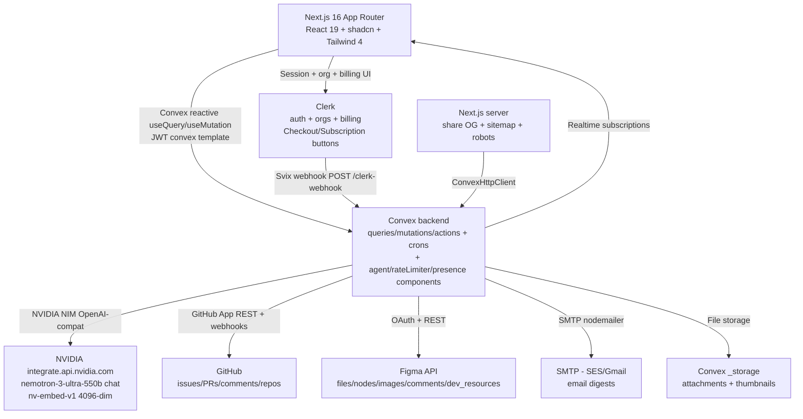
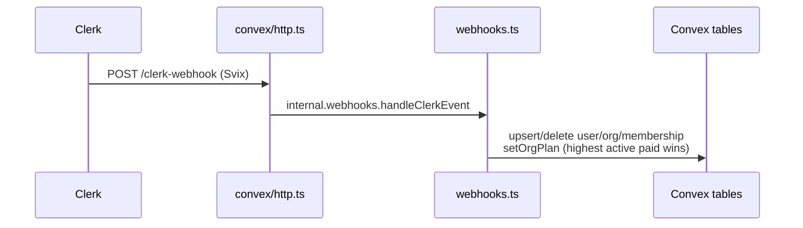
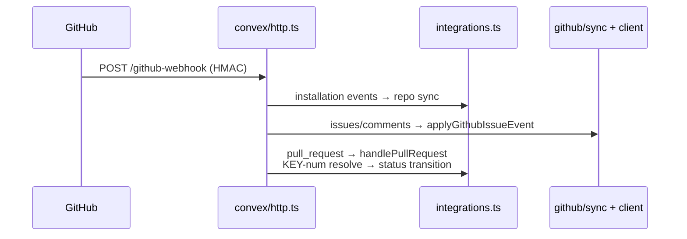
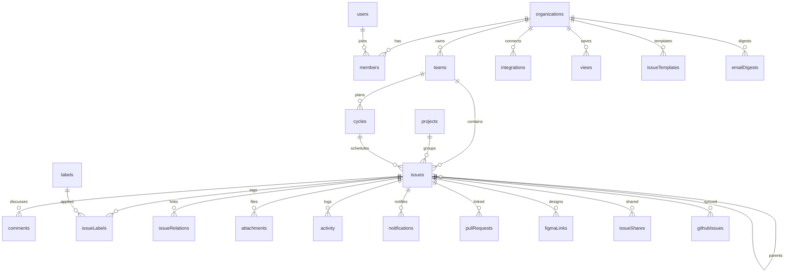
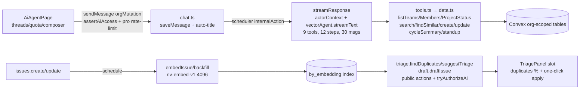

# Skarm — PROJECT_KNOWLEDGE_BASE.md

> Single comprehensive knowledge base for the Skarm repository at `D:\Cloning Github\skarm`.
> Derived from actual code, config, schema, and docs. A new engineer should be able to become productive from this document alone.
> Generated 2026-09-21. All file paths are repo-relative unless stated absolute.

---

## Table of Contents

1. [Project Overview](#1-project-overview)
2. [Root-Level File Analysis](#2-root-level-file-analysis)
3. [Product Understanding](#3-product-understanding)
4. [High-Level Architecture](#4-high-level-architecture)
5. [Repository Structure](#5-repository-structure)
6. [Frontend Analysis](#6-frontend-analysis)
7. [Backend Analysis (Convex)](#7-backend-analysis-convex)
8. [Database Analysis](#8-database-analysis)
9. [Authentication and Security](#9-authentication-and-security)
10. [AI Features Analysis](#10-ai-features-analysis)
11. [Integrations: GitHub, Figma, Email, Presence, Share, Graph](#11-integrations-github-figma-email-presence-share-graph)
12. [Infrastructure Analysis](#12-infrastructure-analysis)
13. [CI/CD Analysis](#13-cicd-analysis)
14. [Environment Variables Reference](#14-environment-variables-reference)
15. [Dependencies Analysis](#15-dependencies-analysis)
16. [User Flows](#16-user-flows)
17. [Development Guide](#17-development-guide)
18. [Architecture Decisions](#18-architecture-decisions)
19. [Risks and Technical Debt](#19-risks-and-technical-debt)
20. [Missing Documentation](#20-missing-documentation)
21. [Future Roadmap Suggestions](#21-future-roadmap-suggestions)

---

## 1. Project Overview

| Field | Value (verified) |
|---|---|
| Project name | Skarm (`package.json:name=skarm`, `version 0.1.0`, `private:true`) |
| Product category | B2B multi-tenant SaaS, Linear clone, AI-native issue tracker |
| Tagline | "Ship at the Speed of Thought" (`app/layout.tsx` metadata) |
| Description | "Skarm is the AI-native issue tracker for modern teams. Plan, track, and ship faster with keyboard-first workflows and intelligent automation." |
| Target users | Software product teams (engineers, PMs, designers) organized in organizations, teams, projects, cycles |
| Core objectives | Plan, track, ship: issues with Linear-style workflow (teams, boards, cycles, projects), realtime collaboration, GitHub/Figma integrations, AI agent with workspace context |
| Key business value | Keyboard-first speed + AI triage/duplicate detection/standup reports + predictable per-seat SaaS billing via Clerk |
| Main features | Issues (CRUD, status/priority/assignee/labels/estimates/due dates/sub-issues/relations), Kanban board (@dnd-kit fractional `sortOrder`), list views + saved views + full-text search, projects with progress, cycles with analytics, comments with @mentions/reactions/threads, activity feed, attachments (Convex storage), presence, dependency graph (@xyflow/react), public share links, AI agent chat + triage + drafts + embeddings, email digests, notifications inbox, GitHub App sync (issues + PRs + attachments), Figma OAuth + link previews + Dev Mode resources + comment push |
| Major workflows | Sign-up → onboarding (create/choose org) → workspace home (My Issues) → team list/board → issue detail collaboration → projects/cycles planning → graph → AI chat → inbox/notifications → settings (billing/members/templates/integrations/notifications/mail) |
| Repository model | Foundation-first + 6 parallel tracks (A Board/Views, B Projects/Cycles, C Issue Collab, D AI Agent, E Billing/Gating, F Landing). Contract in `AGENTS.md`. Branches `track/<name>`. Schema FROZEN. |

What is this product? A Linear clone rebuilt as Next.js 16 App Router + Convex (realtime backend) + Clerk (auth AND billing) + shadcn/ui + Tailwind 4.

Why was it built? Per `.github/README.md`, `.docs/FEATURES.md`, `AGENTS.md`: to provide a fast, keyboard-first, AI-native alternative to Linear/Jira with deep GitHub/Figma convergence and usage-based SaaS monetization.

Who uses it? Members of Clerk organizations with roles `admin` (`org:admin`) or `member`. Admins manage teams, billing, integrations, templates, seed data. Members create/track issues.

What problems does it solve? Scattered planning (issues vs PRs vs designs vs standups), slow triage, duplicate issues, manual cycle reporting, billing complexity. It co-locates issues, PRs, Figma frames, AI context, digests in one org-scoped workspace.

What makes it different? Convex realtime reactivity (no REST polling), Clerk as source of truth mirrored into Convex for joinable queries, NVIDIA NIM AI (Nemotron chat + nv-embed-v1 4096-dim vectors) with org-scoped tools, GitHub bidirectional sync with bot-echo loop guard, Figma Dev Mode sync, capability-token public shares, `ConvexError`-based upgrade prompts.

---

## 2. Root-Level File Analysis

| File | Purpose (verified) |
|---|---|
| `package.json` | Single-project (not monorepo) manifest. Scripts: `dev` = `npm-run-all --parallel dev:frontend dev:backend`, `dev:frontend=next dev`, `dev:backend=convex dev`, `build=next build`, `start=next start`, `lint=eslint`. No test script. See §15 for deps. |
| `pnpm-lock.yaml` | pnpm lockfile v9 (`autoInstallPeers:true`). Canonical manager per `AGENTS.md`/`CLAUDE.md` is pnpm (`pnpm exec tsc --noEmit`, `pnpm lint`). |
| `package-lock.json` | npm lockfile also present. Violates one-manager rule; risk of split resolution trees. Do not use `npx`/`npm` in this repo; use `pnpm dlx`/`pnpm exec`. |
| `pnpm-workspace.yaml` | Trivial: only `allowBuilds: bufferutil, core-js, esbuild, sharp, unrs-resolver, utf-8-validate` + `ignoredBuiltDependencies`. No workspace packages. |
| `tsconfig.json` | `strict`, `target ES2017`, `lib dom+dom.iterable+esnext`, `module esnext`, `moduleResolution bundler`, `jsx react-jsx`, `noEmit`, `isolatedModules`, `paths @/* → ./*`, includes `**/*.ts(x)`, `.next/types`. |
| `eslint.config.mjs` | `defineConfig([...nextVitals, ...nextTs, ...convexPlugin.configs.recommended])` + `globalIgnores [.next, out, build, next-env.d.ts, convex/_generated, .claude]`. |
| `postcss.config.mjs` | Only `@tailwindcss/postcss` plugin (Tailwind 4). |
| `next.config.ts` | Minimal: `{ reactCompiler: true }` (React 19 compiler). |
| `components.json` | shadcn: `style radix-nova`, `rsc true`, `tsx true`, `tailwind css app/globals.css`, `baseColor neutral`, `cssVariables true`, `iconLibrary lucide`, aliases `components→@/components` etc. |
| `proxy.ts` | Next 16 middleware (renamed from `middleware.ts`). `clerkMiddleware`: public routes `/`, `/pricing(.*)`, `/sign-in(.*)`, `/sign-up(.*)`, `/share(.*)`; else `auth.protect()`. Matcher skips internals/static + always runs for `api/trpc`. |
| `app/layout.tsx` | Root layout: Geist fonts, `Providers`, global `Toaster`, SEO metadata (`metadataBase=SITE_URL`, title template `%s · Skarm`). |
| `app/globals.css` | Tailwind 4 imports (`tailwindcss`, `tw-animate-css`, `shadcn/tailwind.css`, `@clerk/ui/themes/shadcn.css`), `@source streamdown`, `@custom-variant dark`, `@theme inline` token mapping, `:root`/`.dark` oklch tokens (dark default), 4px thin scrollbars, chrome-only `user-select:none`, Clerk OrganizationSwitcher fixes, print stylesheet for share PDF export. |
| `.env.example` | Canonical env template (27 lines). See §14. |
| `.env.local` | Local secrets (gitignored). Keys present (values redacted, see §14). Contains real test secrets in this checkout; do not commit. |
| `AGENTS.md` | Parallel-track contract: frozen schema, off-limits shared files, registry one-line rule, placeholder replacement list, no `convex dev` in worktrees, `track/*` branches, conventional commits, architecture rules (wrappers, validators, billing gates, activity logging, UI conventions, routes). |
| `CLAUDE.md` | Symlink or mirror of working agreement (package manager rule, prose style). |
| `OLD.README.md` | Legacy "Cohere" README, gitignored via `.gitignore`. Outdated: references `OPENAI_API_KEY`, old pricing copy. Do not trust. |
| `.github/README.md` | Current product README (features, pricing, arch mermaid, schema, commands). New clones must look here because no root `README.md` exists. |
| `.github/CODEOWNERS` | `@MasterBhuvnesh`. |
| `.github/CONTRIBUTING.md` | Requires `pnpm lint` + `tsc --noEmit` before PR; tests "being written". |
| `.github/SECURITY.md` | Report via Advisories or email; scope: org-scoping bypass, missing Convex enforcement, plan-limit bypass, webhook sig gaps, token leakage, share over-exposure. |
| `.github/CODE_OF_CONDUCT.md` | Covenant 2.1. |
| `.docs/CONFIGURE.md` (~21KB) | Canonical setup: envs, Clerk JWT/billing/webhooks, Convex envs, GitHub App, Figma OAuth, SES digests, deploy + troubleshooting. |
| `.docs/FEATURES.md`, `GITHUB_APP.md`, `TASK.md`, `RULES.md` | Feature list, GitHub App guide, task tracker, markdown/style rules (ALL CAPS headings, no em dash/emoji). |
| `.docs/skarm-ai-about.md`, `skarm-intro-storyboard.html`, `digest-email-preview.html` | AI about, marketing storyboard, email preview fixture. |
| `figma.txt` | Gitignored scratch file. |
| `skills-lock.json` | Agent skills lock. |
| `public/` | `index.md`, `pricing.md`, `llms.txt`, `skarm-*.svg`, OG assets. |
| `convex/convex.config.ts` | Registers components `agent`, `rateLimiter`, `presence`. |
| `convex/auth.config.ts` | Clerk JWT issuer (`CLERK_FRONTEND_API_URL`, `applicationID convex`). |
| `convex/schema.ts` | FROZEN schema + shared validators. See §8. |
| `convex/http.ts` | 4 HTTP routes. See §7. |
| `convex/crons.ts` | 2 crons (templates every 15m, digests hourly). See §7. |
| `app/sitemap.ts`, `robots.ts`, `opengraph-image.tsx`, `icon.svg`, `not-found.tsx`, `error.tsx`, `global-error.tsx` | SEO + boundaries. Sitemap: `/`, `/pricing`, `/index.md`, `/pricing.md`, `/llms.txt`. Robots: allow `/`, disallow `/onboarding,/sign-in,/sign-up`. OG 1200x630 code-generated. |

No `Dockerfile`, `docker-compose.*`, `turbo.json`, `nx.json`, `lerna.json`, Terraform, K8s, Helm. No `.github/workflows` (no CI).

---

## 3. Product Understanding

### 3.1 Project Overview (expanded)

- **Name:** Skarm.
- **Category:** B2B SaaS project management / issue tracking (Linear clone).
- **Users:** Organizations (Clerk orgs) with 1 to unlimited members depending on plan. Two roles: `admin` and `member`.
- **Objectives:** Provide teams, issues, boards, cycles, projects, collaboration, AI, and integrations in one realtime workspace.
- **Business value:** Free tier funnels small teams (3 seats, 2 projects, 100 issues); Pro ($20/mo, $16 annual-equiv, 3 incl + $5/seat to 10) unlocks unlimited projects/issues + AI (50 msgs/user/day); Enterprise ($99/mo, $79 annual-equiv flat) unlocks unlimited members + unlimited AI + priority support. Single source `lib/plans.ts`.
- **Features (verified in code):** See table in §1 plus §6-§11 details.
- **Workflows:** See §16.

### 3.2 Why / Who / What problems / Differentiators

See §1 answers. Additional evidence:

- Design doc reference: `docs/specs/2026-06-12-linear-clone-design.md` (cited in `AGENTS.md`; `docs/` not present in this checkout, only `.docs/`).
- Marketing proof: `app/(marketing)/page.tsx` composes Hero, LogoCloud, FeaturesIssues/Board/Ai/Keyboard, FeatureGrid, Testimonials, Cta, Footer with 23 `components/marketing/*` mocks.
- Billing proof: `app/(marketing)/pricing/page.tsx` renders `PricingTable` + `FeatureComparison`; `lib/plans.ts` holds IDs `cplan_3F1zEN33U3ist3e1eWPiu7xwDUg` (free), `cplan_3FXMPCVWYxFv5GLBi1C93gqRGfb` (pro), `cplan_3FXMTzv5ifQQt6wUGD9AYl7G1dz` (enterprise).

---

## 4. High-Level Architecture

### 4.1 System context (Mermaid)



### 4.2 Frontend architecture

- App Router route groups: `(marketing)` public, `(app)/[orgSlug]` authenticated workspace, `sign-in`/`sign-up`/`onboarding`/`share`.
- Almost entirely Client Components (`"use client"` on all app routes except marketing/pricing/share/settings-redirect). Only `share/[token]` and marketing fetch server-side via `ConvexHttpClient`.
- State: no Redux/Zustand. Store = Convex reactive cache + URL search params + local `useState` drafts. `usePaginatedQuery` for team list + 6 board columns. `"skip"` to disable queries. `useMutation` + `sonner` toasts. One optimistic update (`optimisticallySendMessage` in AI chat).
- Providers (`components/providers.tsx`): `ThemeProvider(dark default, system enabled)` > `ClerkProvider(ui={ui}, theme shadcn)` > `ConvexProviderWithClerk(client, useAuth)` > `TooltipProvider`. Single `ConvexReactClient(NEXT_PUBLIC_CONVEX_URL)`.
- UI: 27 shadcn Radix primitives in `components/ui/` (off-limits), `lucide-react` icons only, Linear density (`h-7/h-9`, `text-xs/sm`), `ScrollArea` every scroll region, `Loader2` spinners, `undefined` (loading) vs `null` (not-found) handling, `ConvexError.data` extraction.

### 4.3 Backend architecture

- Convex functions with wrappers from `convex/lib/customFunctions.ts`: `orgQuery/orgMutation` (default, injects `user/org/membership`), `orgAdminMutation` (+ admin check), `authedQuery/authedMutation` (org-agnostic), public `query/mutation` forbidden except `users.current`, `organizations.current`, `share.getByToken`. Scheduler/webhook = `internalQuery/internalMutation/internalAction` or public `action`.
- Auth resolution in `convex/lib/auth.ts#getAuthContext`: JWT `org_id` → `organizations.by_clerk_org_id` → `members.by_org_and_user` verification. Throws `Not authenticated / User not synced / No active organization / Organization not synced / Not a member`.
- Billing enforcement in `convex/lib/limits.ts`: `FREE_PLAN_LIMITS {seats:3, projects:2, issues:100}`, `assertCanCreateIssue` (counts `by_org`, paid bypass, throws `ConvexError` at 100), `assertCanCreateProject` (throws at 2), `hasAiAccess = pro||enterprise`. Seats enforced by Clerk plan cap, not Convex.
- Activity via `convex/lib/activity.ts#logActivity` (requires `actorId` or `systemActor:github`).
- Validators required on args AND returns of every public function; shared validators imported from `convex/schema.ts`.
- HTTP (`convex/http.ts`): `POST /clerk-webhook` (Svix), `POST /github-webhook` (HMAC-SHA256), `GET /github-setup` (nonce redirect), `GET /figma-callback` (OAuth exchange). All `httpAction`.
- Crons (`convex/crons.ts`): `runDue` every 15m, `sendDigest.sweep` hourly at minute 0.
- Components (`convex/convex.config.ts`): `agent`, `rateLimiter`, `presence`.

### 4.4 Database architecture

- Convex document DB, ~25 tables (see §8). Clerk-mirrored: `users`, `organizations`, `members`. Workspace: `teams`, `issues`, `labels`, `issueLabels`, `issueRelations`, `comments`, `activity`, `notifications`, `notificationPrefs`, `projects`, `cycles`, `attachments` (`_storage`), `views`, `issueTemplates`, `emailDigests`, `integrations`, `githubInstallStates`, `figmaLinks`, `pullRequests`, `githubAttachmentComments`, `githubIssues`, `graphLayouts`, `issueShares`.
- Indexes: `by_org`, `by_team`, `by_team_and_number`, `by_team_and_status`, `by_assignee`, `by_creator`, `by_project`, `by_cycle`, `by_parent`, plus specialized (`by_clerk_id`, `by_clerk_org_id`, `by_slug`, `by_org_and_key`, `by_token`, `by_org_repo_number`, `by_installation`, `by_nonce`, `by_next_run`, `by_enabled`, `by_user`, `by_user_read`, `by_org_user`, `by_org_scope`).
- Search: `search_title`, `search_description` (filter `orgId+teamId`). Vector: `by_embedding` (`dimensions:4096`, `filterFields:[orgId]`, must match `nv-embed-v1`).

### 4.5 External services

| Service | Use | Auth |
|---|---|---|
| Clerk | Auth + orgs + memberships + billing (Checkout/Subscription/PlanDetails buttons, `has({plan/feature/role})`) | Publishable + secret keys, `convex` JWT template with `org_id/org_slug/org_role` claims, webhook secret |
| Convex | Backend + realtime + storage + crons + components | Deployment URL, `CONVEX_DEPLOYMENT`, site URL |
| NVIDIA NIM | Chat (`nemotron-3-ultra-550b-a55b`) + embeddings (`nv-embed-v1`) via `@ai-sdk/openai` compat | `NVIDIA_API_KEY` |
| GitHub App | Install, repo list, issue sync, PR linking, attachment comments | `GITHUB_APP_SLUG/CLIENT_ID/APP_ID/PRIVATE_KEY/WEBHOOK_SECRET`, RS256 JWT (9m), per-call installation token |
| Figma | OAuth, previews, Dev Mode resources, comment push | `FIGMA_CLIENT_ID/SECRET`, per-org tokens + refresh |
| SMTP (SES/Gmail) | Email digests via `nodemailer` | `SMTP_USER/PASSWORD/HOST/PORT/FROM` |

### 4.6 Authentication flow (step-by-step)

1. User visits protected route → `proxy.ts` `clerkMiddleware` `auth.protect()` (public: `/`, `/pricing`, `/sign-in`, `/sign-up`, `/share`).
2. Clerk `<SignIn/>`/`<SignUp/>` catch-all → fallback redirect `/onboarding`.
3. `/onboarding` `OrgChooser`: `useOrganizationList`; create via `<CreateOrganization afterCreateOrganizationUrl=/:slug>`, accept invites, auto-redirect if active org exists.
4. `/(app)/[orgSlug]` `WorkspaceShell`: matches URL slug to Clerk active org via `setActive`, guards stale-slug loops, gates on `api.users.current`/`api.organizations.current` (webhook sync loaders), compares orgs by ID.
5. Every Convex call sends Clerk JWT (`ConvexProviderWithClerk`); backend `getAuthContext` resolves `user/org/membership` and verifies membership. `orgAdminMutation` additionally requires `role==admin`.
6. Clerk webhooks (`user/organization/membership/subscription*`) mirror into Convex tables; out-of-order delivery throws so Svix retries.

### 4.7 Authorization flow

- Two roles: `admin` (`org:admin`) vs `member`. Surfaced in onboarding/members UI.
- Enforcement only in `orgAdminMutation`: `teams.create`, `integrations.*`, `seed.demoData`. All other workspace data requires membership + `orgId` equality on every loaded doc (`getOrg*` helpers).
- Billing: Convex `ctx.org.plan` is enforcement; Clerk `has()` is cosmetic. AI requires `hasAiAccess`; free create paths throw `ConvexError` upgrade messages; UI `PlanLimitListener` shows upgrade prompt.
- Public share: capability token (`crypto.randomUUID` no dashes), unauth `getByToken` returns sanitized fields only, revocable.

### 4.8 API communication

- No REST except HTTP webhooks/OAuth callbacks. All app data via Convex `useQuery` (86 matches) / `usePaginatedQuery` / `useMutation` / `useAction`. Server `share/[token]` uses `ConvexHttpClient`.
- Errors: `ConvexError` for expected failures (toast + upgrade prompt, no dev overlay); plain `Error` for unexpected (throws, retries).

### 4.9 Event flows





### 4.10 Queues / background jobs / caching / storage

- No SQS/Bull/Redis. Background = Convex scheduler (`runAfter/schedule`) + crons (15m templates, hourly digests) + `internalAction` (`"use node"` only in `github/client.ts`, `email/sendDigest.ts`).
- Caching: Convex reactive query cache + `useUIMessages` (50 initial, streaming) + team label cache (`teamIssueLabels`) + presence in-memory. No CDN/RBAC cache layer.
- Storage: Convex `_storage` for attachments (25MB cap, `generateUploadUrl` + `getUrl`), thumbnails via Figma image API URLs (not stored).

### 4.11 Request lifecycle (example: create issue)

1. UI `CreateIssueDialog` (teams/templates/projects/labels lazily queried on open) → `api.issues.create`.
2. `orgMutation` resolves auth → validates team/project/labels org → checks GitHub repo in `project.githubRepos` → `insertIssue` → `assertCanCreateIssue` → claims `team.nextIssueNumber`, `sortOrder=max+1000` → inserts `issueLabels` → logs `created` → creates sub-issues/relations → schedules `github.client.pushIssue` → `autoLinkFigmaUrls`.
3. Reactive `useQuery` subscribers update board/list/detail instantly. `ConvexError` limit breach → toast + `PlanLimitListener` upgrade prompt.

### 4.12 Data lifecycle

Clerk (source) → Svix/HMAC webhooks → Convex mirror tables → org-scoped queries → React subscriptions → mutations with activity/notifications → outbound sync (GitHub push, Figma dev sync, embeddings) → vector/search indexes → AI tools/digests/graph.

### 4.13 User lifecycle

Anonymous (marketing/pricing/share) → sign-in/up → onboarding (org create/choose/accept) → member (issues/boards/cycles) → admin (teams/billing/integrations/templates/seed) → seat-gated by Clerk plan → plan-gated features (AI, unlimited) → digest/notification engaged → deleted (user/org/membership webhooks cascade memberships only; workspace data left for future cleanup job).

---

## 5. Repository Structure

```
skarm/
  app/                       Next.js App Router
    layout.tsx, globals.css, error.tsx, global-error.tsx, not-found.tsx
    sitemap.ts, robots.ts, opengraph-image.tsx, icon.svg
    (marketing)/page.tsx, pricing/page.tsx, layout.tsx, loading.tsx
    sign-in/[[...sign-in]]/, sign-up/[[...sign-up]]/, onboarding/
    (app)/[orgSlug]/layout.tsx, page.tsx (home), team/[teamId]/, team/[teamId]/board/,
      issue/[issueId]/, search/, inbox/, graph/, ai/, projects/, projects/[projectId]/,
      cycles/, cycles/[cycleId]/, settings/{billing,members,templates,integrations,notifications,mail}
    share/[token]/ (+ opengraph-image.tsx)
  components/
    ui/ (27 shadcn primitives, off-limits)
    shell/ (workspace-shell, app-sidebar, theme-toggle)
    commands/ (registry, command-provider)
    board/, views/, issues/, issue-detail/ (16 panels + slots registry), projects/, cycles/,
    ai/ (11), billing/ (13), marketing/ (23), shared/ (8), settings/, teams/, graph/, share/, onboarding/
    providers.tsx
  convex/
    schema.ts, auth.config.ts, convex.config.ts, http.ts, webhooks.ts, crons.ts, seed.ts
    issues.ts, teams.ts, projects.ts, cycles.ts, comments.ts, activity.ts, attachments.ts,
    labels.ts, views.ts, search.ts, notifications.ts, organizations.ts, users.ts, share.ts,
    graph.ts, integrations.ts, figma.ts, emailDigests.ts, issueTemplates.ts,
    issueRelations.ts, presenceFns.ts
    lib/{auth,customFunctions,limits,activity,siteUrl,figmaLinks}.ts
    agent/{models,vectorAgent,tools,data,chat,embeddings,triage,draft,authorize,limiter}.ts
    github/{sync,client}.ts
    email/{sendDigest,template}.ts
    _generated/ (committed, types resolve without deploy)
  lib/ (utils cn+matchSnippet, site SITE_URL, plans single source)
  hooks/ (use-debounced-value only)
  public/ (index.md, pricing.md, llms.txt, svgs)
  .docs/, .github/, .agents/, .claude/
  proxy.ts, next.config.ts, tsconfig.json, eslint.config.mjs, postcss.config.mjs,
  components.json, pnpm-workspace.yaml, package.json, .env.example
```

| Folder | Purpose | Responsibility | Dependencies | Important files | Relations |
|---|---|---|---|---|---|
| `app/` | Routes + layouts + metadata | Route definitions, server share/SEO, auth shells | `components/*`, `convex/_generated/api`, `lib/*`, Clerk/Convex | `layout.tsx`, `(app)/[orgSlug]/layout.tsx`, `share/[token]/page.tsx` | Renders `components/*`; calls `convex/*` via hooks or `ConvexHttpClient` |
| `components/shell` | Auth gate + nav | Org-sync, sidebar, theme | Clerk, `api.users/organizations/teams/notifications` | `workspace-shell.tsx`, `app-sidebar.tsx` | Wraps all `(app)` pages; hosts `CommandProvider` + `PlanLimitListener` |
| `components/commands` | Palette + shortcuts | Global `⌘K`, single-key (`c`, `a`, `⌘B`), deep-links | `components/*/commands.ts` | `registry.ts` (one-line additions only) | Aggregates per-track commands |
| `components/board`, `views` | Track A | Kanban (@dnd-kit fractional sortOrder), filters, saved views | `api.issues/views/search` | `board-view.tsx`, `filters.ts` | Links from team page List/Board tabs |
| `components/issues` | Issue creation/rows/templates | Global create dialog, dense rows, rituals | `api.issues/teams/labels/templates` | `create-issue-dialog.tsx` | Used by palette (`c`) + sidebar |
| `components/issue-detail` | Track C + slots registry | Comments, activity, sub-issues, relations, attachments, presence, Figma, PRs, AI triage | `api.comments/activity/attachments/relations/presence/figma/agent` | `slots.tsx` (registry), `issue-properties.tsx` (foundation) | Rendered by `issue/[issueId]/page.tsx` main/sidebar slots |
| `components/projects`, `cycles` | Track B | CRUD + progress + analytics + candidate pickers | `api.projects/cycles/issues` | `grouped-issue-list.tsx`, `cycle-analytics.tsx` | Assign via `issues.update` (projectId/cycleId) |
| `components/ai` | Track D | Chat threads/quota/composer/conversation + triage panel | `api.agent.*`, `has({feature:ai_agent})` | `ai-agent-page.tsx`, `triage-panel.tsx` | Route `/ai`; slot in issue detail |
| `components/billing` | Track E | Pricing table, plan cards, seat/usage/upgrade, members, limit listener | `lib/plans.ts`, Clerk billing components | `pricing-table.tsx`, `upgrade-prompt.tsx` | Routes `/pricing`, `settings/billing|members` |
| `components/marketing` | Track F | Landing mocks + sections | None (static + mock-data) | `hero.tsx`, `mock-*.tsx` | Rendered by `(marketing)/page.tsx` |
| `components/shared` | Primitives | Status/Priority icons, avatars, label chips, meta constants, logos | `lucide-react` | `issue-meta.ts` | Used everywhere for density |
| `convex/` | Backend | All queries/mutations/actions + HTTP + crons | Clerk JWT, NVIDIA, GitHub, Figma, SMTP | `schema.ts`, `http.ts`, `webhooks.ts` | Called by `app/components` via generated `api` |
| `convex/agent` | AI | Models, tools, chat, embeddings, triage, drafts | `@convex-dev/agent`, `@ai-sdk/openai`, rate-limiter | `models.ts`, `chat.ts` | Gated by `hasAiAccess` + `ai_agent` feature |
| `convex/github`, `email` | Transports | Sync + digests (`"use node"`) | `nodemailer`, GitHub REST | `client.ts`, `sendDigest.ts` | Scheduled from issue/comment/attachment paths |
| `lib/` | Frontend constants | `cn`, `matchSnippet`, `SITE_URL`, plans | Clerk IDs | `plans.ts` (never inline IDs) | Mirrors `convex/lib/limits.ts` caps |
| `hooks/` | Utilities | Debounce search 250ms | React | `use-debounced-value.ts` | Used by search/filter inputs |

---

## 6. Frontend Analysis

### 6.1 Technology stack

| Concern | Implementation (verified) |
|---|---|
| Framework | Next.js 16.2.9 App Router, React 19.2.4, React Compiler on, TypeScript 5 strict |
| Routing | File-system groups `(marketing)`, `(app)/[orgSlug]`, dynamic `[teamId]`, `[issueId]`, `[projectId]`, `[cycleId]`, `[token]`; `useParams<{orgSlug}>`, `useSearchParams` filters, `?new=true` deep-links |
| State | Convex cache + URL + local `useState`; no Redux/Zustand |
| Data fetching | `useQuery` (86 sites), `usePaginatedQuery` (team list + 6 board columns), `"skip"`, `useMutation` + `sonner`, one optimistic (`optimisticallySendMessage`) |
| Forms | Controlled dialogs (create issue/project/cycle/team), inline title/desc edits, digest editor with explicit save, template manager |
| Validation | Frontend regex (team key `^[A-Z][A-Z0-9]{0,4}$`), weekday/dayOfMonth, JSON filters ≤4096; authoritative Convex validators on args+returns |
| Auth | `useAuth().has({role/plan/feature})`, `useOrganization/useOrganizationList`, `<SignIn/SignUp/CreateOrganization/OrganizationSwitcher/UserButton/Show/CheckoutButton/PlanDetailsButton/SubscriptionDetailsButton>`, `useSubscription` |
| i18n | None (English only) |
| Theming | `next-themes` (`attribute class`, `defaultTheme dark`, `enableSystem`), oklch tokens, `ThemeToggle`, graph `colorMode` follows theme |
| UI | shadcn Radix Nova (`neutral`, CSS vars), `lucide-react`, `@xyflow/react`, `streamdown` markdown, `@convex-dev/agent/react`, `@dnd-kit`, `cmdk`, `sonner`, `ldrs` |

### 6.2 Pages (every route)

| Route | File | Purpose | Components | API calls | Flow |
|---|---|---|---|---|---|
| `/` | `(marketing)/page.tsx` | Landing | Hero, LogoCloud, Features*, FeatureGrid, Testimonials, Cta, Footer | None (static) | Server component + metadata |
| `/pricing` | `(marketing)/pricing/page.tsx` | Pricing | PricingTable, FeatureComparison | None (static, `lib/plans.ts`) | Monthly/annual toggle → CheckoutButton |
| `/sign-in/*` | `sign-in/[[...sign-in]]/page.tsx` | Login | `<SignIn/>` centered | Clerk | → `/onboarding` fallback |
| `/sign-up/*` | `sign-up/[[...sign-up]]/page.tsx` | Register | `<SignUp/>` centered | Clerk | → `/onboarding` fallback |
| `/onboarding` | `onboarding/page.tsx` | Org chooser | OrgChooser | `useOrganizationList`, `<CreateOrganization>` | Create/accept/auto-redirect |
| `/share/:token` | `share/[token]/page.tsx` | Public issue | PublicIssueView | `ConvexHttpClient api.share.getByToken` (server) | Sanitized view or revoked 404 + OG |
| `/:orgSlug` | `(app)/[orgSlug]/page.tsx` | Home | MyIssuesDashboard | `api.teams.list`, `api.seed.demoData` (admin, empty only), `api.issues.myIssues` | Assigned/Created tabs, status-grouped |
| `/:orgSlug/team/:teamId` | `team/[teamId]/page.tsx` | Team list | IssueRow, tabs | `api.teams.get`, `usePaginatedQuery api.issues.listByTeamPaginated`, `api.search.issues` (debounced) | Infinite scroll, List/Board switch |
| `.../board` | `team/[teamId]/board/page.tsx` | Kanban | FilterBar, ViewSwitcher, BoardView, FilteredIssueList | 6× `listByTeamStatusPaginated`, `api.search.issues` | URL filters, search ID narrowing |
| `/:orgSlug/issue/:issueId` | `issue/[issueId]/page.tsx` | Detail | Main/sidebar slots, IssueProperties | `api.issues.get`, `api.teams.get`, `api.issues.update` | Inline edit, slot panels |
| `/:orgSlug/search` | `search/page.tsx` | Global search | Select team filter | `api.search.issues` (debounced) | Result rows → issue detail |
| `/:orgSlug/inbox` | `inbox/page.tsx` | Notifications | Tabs All/Mentions/Assigned/Status/GitHub | `api.notifications.list/markRead/markAllRead` (cap 50) | Click-through to issue |
| `/:orgSlug/graph` | `graph/page.tsx` | Dependency graph | ReactFlow, IssueNode | `api.graph.forScope/savePositions`, `api.issueRelations`, `api.issues.update` | Scope picker, drag assign, edge CRUD, persist |
| `/:orgSlug/ai` | `ai/page.tsx` | AI chat | AiAgentPage | `api.agent.chat.*` | Thin wrapper |
| `/:orgSlug/projects` | `projects/page.tsx` | Projects index | ProjectRow, CreateProjectDialog | `api.projects.listWithProgress` | `?new=true` opens dialog |
| `.../:projectId` | `projects/[projectId]/page.tsx` | Project detail | GroupedIssueList, ProjectProperties, AddIssuesPopover | `api.projects.update`, `candidateIssues`, `api.issues.update` | Editable header, progress |
| `/:orgSlug/cycles` | `cycles/page.tsx` | Cycles index | CycleRow, CreateCycleDialog | `api.cycles.listWithProgress`, `api.teams.list` | Grouped by team, `?new=true` |
| `.../:cycleId` | `cycles/[cycleId]/page.tsx` | Cycle detail | CycleAnalytics, GroupedIssueList | `api.cycles.listIssues/analytics`, `api.issues.update` | Burndown, add/edit/delete |
| `settings` | `settings/page.tsx` | Redirect | — | — | → `settings/billing` |
| `settings/billing` | `settings/billing/page.tsx` | Billing | CurrentPlanCard, SeatManager, UsageCard, UpgradeOptions | `api.organizations.current` | Gated summaries + Checkout |
| `settings/members` | `settings/members/page.tsx` | Members | MembersManager | Clerk invites | Browser-to-Clerk invites |
| `settings/templates` | `settings/templates/page.tsx` | Templates | TemplateManager | `api.issueTemplates.*` | Rituals CRUD |
| `settings/integrations` | `settings/integrations/page.tsx` | Integrations | IntegrationsManager | `api.integrations.*` | GitHub + Figma connect |
| `settings/notifications` | `settings/notifications/page.tsx` | Prefs | Switches | `api.notifications.getPrefs/setPref` | Per-channel toggles |
| `settings/mail` | `settings/mail/page.tsx` | Digests | Pills + switches | `api.emailDigests.getSettings/saveSettings/sendTest` | Explicit save with tz |

Supporting: `error.tsx`, `global-error.tsx` (branded + `reset`), `not-found.tsx`, `sitemap.ts`, `robots.ts`, `opengraph-image.tsx`, `share/[token]/opengraph-image.tsx`, `(marketing)/loading.tsx`, `icon.svg`.

### 6.3 Components, layouts, hooks, utilities

- **Layouts:** `app/layout.tsx` (fonts+Providers+Toaster+SEO) → `(marketing)/layout.tsx` (sticky nav Features/AI/Pricing + `Show` signed-out/in, app-logic free) → `(app)/[orgSlug]/layout.tsx` (param unwrap → `WorkspaceShell`) → `settings/layout.tsx` (header + `SettingsNav` + `max-w-2xl`).
- **Shell:** `WorkspaceShell` (slug↔active-org sync, webhook loaders, `CommandProvider` + `PlanLimitListener` + `AppSidebar` + `main`); `AppSidebar` (`w-64/w-14`, `⌘B`, OrganizationSwitcher, Create `C`, Search `⌘K`, nav Workspace/Projects/Cycles/Graph/AI, Your teams, Inbox badge `unreadCount`, My Issues, Settings, ThemeToggle, UserButton).
- **Commands:** `registry.ts` `AppCommand{id,label,group,icon,shortcut,run}`; builtins (create-issue `c`, go-home, toggle-theme) + `boardViewCommands`, `projectCycleCommands`, `billingCommands`, `aiCommands` (open-ai `a`). Provider handles `⌘K`, single-key guard (not typing), `CommandDialog`, global `CreateIssueDialog`.
- **Issue detail slots:** `issueDetailMainSlots=[SubIssuesPanel, ActivitySection, AiTriagePanel, PlanLimitListener]`, `issueDetailSidebarSlots=[PresencePanel, LabelsPanel, RelationsPanel, AttachmentsPanel, PullRequestsPanel, FigmaPanel, IssueProjectCyclePanel]`. `slots.tsx` allows one-line additions only.
- **Shared:** `status-icon`, `priority-icon`, `user-avatar`, `label-chip`, `issue-meta.ts` (`STATUSES`, `PRIORITIES`), `skarm-logo`, `github-icon`, `figma-icon`.
- **Hooks:** `use-debounced-value.ts` only.
- **Utils:** `lib/utils.ts` (`cn`, `matchSnippet`), `lib/site.ts` (`SITE_URL`), `lib/plans.ts` (IDs/slugs/prices/features/comparison).

---

## 7. Backend Analysis (Convex)

Auth wrappers: see §4.3. Billing: `lib/limits.ts`. Activity: `lib/activity.ts`. Validators: every public function has args+returns validators.

### 7.1 HTTP + webhooks + crons + seed

| File | Exports | Details |
|---|---|---|
| `http.ts` | `POST /clerk-webhook`, `POST /github-webhook`, `GET /github-setup`, `GET /figma-callback` | Svix verify (`CLERK_WEBHOOK_SECRET`) → `internal.webhooks.handleClerkEvent`; GitHub HMAC-SHA256 (`GITHUB_WEBHOOK_SECRET`, constant-time) → installation → `handleInstallationEvent`, issues/comments (skip Bot, `commented/edited/closed/reopened` only) → `applyGithubIssueEvent`, PR (`opened/reopened/ready_for_review/edited/closed`) → `handlePullRequest` with `text=branch+title+body`; setup/callback validate nonce/code, exchange Figma tokens, 302 to `/{slug}/settings/integrations` |
| `webhooks.ts` | `handleClerkEvent internalMutation{eventType,data}` | `user.created/updated→upsert` (name from first+last or email), `deleted→delete+members`; `organization.created/updated→upsert` (new defaults `plan:free`), `deleted→delete+members` (workspace left for cleanup job); `membership.created/updated→upsert` (`org:admin→admin`, throws if org/user missing so Svix retries), `deleted→delete`; `subscription.*→syncSubscription` (highest active/upcoming paid wins else free, `free_org→free`); `subscriptionItem.*→syncSubscriptionItem` (active→set, canceled/ended/expired/abandoned→downgrade only if `org.plan==itemPlan`). Only `setOrgPlan` mutates plan. Clerk dot-notation names, never Stripe-style. |
| `crons.ts` | 2 crons | `runDue` every 15m; `sendDigest.sweep` hourly minute 0 |
| `seed.ts` | `demoData orgAdminMutation` | Throws if teams exist. Direct inserts (bypasses billing but sized inside free: 2 projects, 46 issues incl 3 sub, 8 labels, 3 ENG +1 DSN cycles, 2 templates, 6 comments, 2 relations); logs `created/status_changed/assignee_changed/commented`; sets `nextIssueNumber`; returns counts |

### 7.2 Core domain APIs

**`issues.ts`** — `listByTeam`, `listByTeamPaginated{paginationOpts}`, `listByTeamStatusPaginated{+status}`, `myIssues{}` (assignee+creator dedupe, `teamKey` enrich), `get{issueId}` (null on cross-org), `getByNumber{teamId,number}`, `create{teamId,title,desc?,status?,priority?,assigneeId?,projectId?,cycleId?,parentIssueId?,estimate?,dueDate?,labelIds?,githubRepo?,subIssues?[],relations?[]}` (validates orgs, repo in `project.githubRepos`, delegates to `insertIssue`, normalizes `blocked_by→blocks`, dual logs, schedules GitHub push + Figma autolink), `update{issueId+optional fields}` (diffs + `{field}_changed` logs, assign/status notifications skip self, GitHub sync on title/desc/status, Figma autolink/dev sync), `remove{issueId}` (deletes `issueLabels`, no activity). Helper `insertIssue` enforces `assertCanCreateIssue`, claims `nextIssueNumber`, `sortOrder=max+1000`.

**`teams.ts`** — `list{}`, `get{teamId}` (`orgQuery`); `create{name,key,description?}` (`orgAdminMutation`, uppercases key, `^[A-Z][A-Z0-9]{0,4}$`, unique `by_org_and_key`, `nextIssueNumber:1`).

**`projects.ts`** — `list{}`, `listWithProgress{}` (progress via `by_project`+org filter), `get{projectId}`, `listIssues{projectId}`, `candidateIssues{projectId}` (recent 500 `by_org`, exclude in, cap 200); `create{...}` (`orgMutation` + `assertCanCreateProject`, lead must be member); `update{...githubRepos?[]}` (validates `owner/name`, dedupes, retires legacy `githubRepo`); `remove{projectId}` (detaches issues + `project_changed` per issue).

**`cycles.ts`** — `listByTeam{teamId}`, `listWithProgress{}` (+teamName/Key+progress), `get{cycleId}`, `currentForTeam{teamId}` (active latest start), `listIssues{cycleId}`, `candidateIssues{cycleId}`, `analytics{cycleId}` (`days[{date,remaining}]`, scope/added/removed/completed/total points, `velocity[6]` from `activity cycle_changed/status_changed`, `points=estimate??1`); `create{teamId,name?,startDate,endDate}` (auto-number `max+1`, `end>start`), `update`, `remove` (unschedules + `cycle_changed` per issue).

**`comments.ts`** — `listByIssue{issueId}` (enriched author/mentions/reactions+`reactedByMe`); `create{issueId,body,mentions?[],parentId?,postToFigma?}` (non-empty, `filterToOrgMembers`, flatten replies to root, `commented` log, `mention`+`reply` notifs, Figma autolink + `pushComment`); `update` (author-only), `toggleReaction` (emoji ≤8), `remove` (author-or-admin, root deletes replies).

**`activity.ts`** — `listByIssue{issueId}` only (renderer; writes elsewhere; resolves actor names, `github→GitHub`, assignee IDs→names).

**`attachments.ts`** — `listByIssue` (`uploaderName`, `getUrl`), `generateUploadUrl{}`, `create{issueId,storageId,fileName,fileType,fileSize}` (`MAX 25MB`, `attachment_added`, schedules GitHub comment), `remove{attachmentId}` (uploader-or-admin, schedules removal, deletes storage+row, `attachment_removed`).

**`labels.ts`** — `list{}`, `listForIssue{issueId}`; `create{name,color}`, `toggleOnIssue→bool`. No activity.

**`views.ts`** — `list{}` (shared+own sorted), `teamIssueLabels{teamId}`; `create{name,filters,shared}`, `update`, `remove` (creator-or-admin; `filters` JSON ≤4096).

**`search.ts`** — `issues{query,teamId?}`: empty→`[]`; `search_title` (20) + `search_description` (20) filtered `orgId(+teamId)`, title-first dedupe cap 25, enrich `teamKey/teamName`.

**`notifications.ts`** — helper `createNotification` (skips self, respects `notificationPrefs` mapping, missing doc=all on); `getPrefs{}`, `list{}` (50 newest enriched, hides deleted), `unreadCount{}` (cap 100), `setPref{key,enabled}` (upsert), `markRead` (owner+org), `markAllRead`.

**`organizations.ts`** — `current{}` (public, null while identity/user/`org_id`/org/membership missing); `listMembers{}` (`by_org`+join).

**`users.ts`** — `current{}` (public → `getCurrentUserOrNull`).

**`share.ts`** — `getForIssue` (token or null), `create{issueId}` (idempotent, `randomUUID` no dashes), `revoke{issueId}`; `getByToken{token}` (public, sanitized `{identifier,title,desc,status,priority,estimate,labels,createdAt,teamName,orgName}`, never assignees/comments/attachments/ids).

**`graph.ts`** — `forScope{projectId?,cycleId?}` (verifies org, empty if none; nodes+edges filtered in-scope, `blocked_by` never stored, saved `positions` via `by_org_scope`); `savePositions{...}` (requires scope, upsert).

**`issueRelations.ts`** — `listForIssue` (outgoing+incoming with `INVERSE`, skips cross-org), `hierarchy{issueId}` (parent+sub sorted), `searchIssues{query,excludeIssueId?}` (15 or recent 15); `create{issueId,relatedIssueId,type}` (no self, normalize `blocked_by→blocks`, one-pair-either-direction, dual `relation_added`), `remove{relationId}` (dual `relation_removed`), `setParent{issueId,parentId|null}` (self + 100-depth cycle check, `parent_changed`).

**`issueTemplates.ts`** — `list{}` (cap 200); `create/update{teamId,name,titlePrefix,...,cadence?,weekday?,dayOfMonth?,scheduleEnabled}` (`resolveSchedule`, `nextRunAt=computeNextRun(now)` 9:00 UTC); `remove`; `runDue internalMutation` (cron, `by_next_run≤now` cap 100, advance first for idempotence, `insertIssue` backlog, title `{prefix} - {Mon D, YYYY}`, billing via `insertIssue`, failures caught).

**`emailDigests.ts`** — `getSettings{}` (defaults `enabled:false,morning,daily,[1],all on,tz:0`), `saveSettings{...}` (validates days/weekly/custom/sections), `sendTest{}` (schedules `deliver force:true`); `listDue{now} internalQuery` (local hour `morning 8/evening 18/any 9`, weekday match, `lastSentDay` guard), `markSent`, `getDigestData` (assigned/inProgress/focus `urgent or due<72h`, mentions since `lastSentAt??24h`, caps 20/300, paths `/{slug}/issue/{id}`).

**`presenceFns.ts`** — `heartbeat{roomId,userId,sessionId,interval}` (`orgMutation`, validates `issues` id + membership, forces `userId=ctx.user`, returns tokens); `list{roomToken}` (filters org members, enriches); `disconnect{sessionToken}`. `@convex-dev/presence` component.

**`integrations.ts` / `figma.ts` / `github/*` / `agent/*` / `email/*`** — see §10-§11.

Error handling: `ConvexError` for expected (auth/billing/validation) → toast + upgrade prompt; plain `Error` for unexpected/sync races → Svix retry or visible AI fallback. Validation: args+returns validators on every public function.

---

## 8. Database Analysis

Validators: `issueStatus(backlog|todo|in_progress|in_review|done|canceled)`, `issuePriority(none|urgent|high|medium|low)`, `plan(free|pro|enterprise)`, `memberRole(admin|member)`, `projectStatus(backlog|planned|in_progress|paused|completed|canceled)`, `issueRelationType(blocks|blocked_by|related|duplicate_of)`, `templateCadence(daily|weekdays|weekly|monthly)`, `notificationType(mention|assigned|status_changed|reply)`.

| Table | Purpose | Key fields | Relationships | Constraints/Indexes | Usage |
|---|---|---|---|---|---|
| `users` | Clerk user mirror | `clerkId, name, email, imageUrl?` | `members.userId`, `issues.assignee/creator`, `comments.author`, `activity.actor` | `by_clerk_id` | Webhook-written only; `current` gates shell |
| `organizations` | Clerk org mirror + plan | `clerkOrgId, name, slug?, imageUrl?, plan, subscriptionStatus?` | `members.orgId`, all `orgId` FKs | `by_clerk_org_id`, `by_slug` | Source for `ctx.org`; plan gates |
| `members` | Membership + role | `orgId, userId, role, clerkMembershipId` | →orgs/users | `by_org, by_user, by_org_and_user, by_clerk_membership_id` | Auth verification; `listMembers` for mentions |
| `teams` | Workspace teams | `orgId, name, key (ENG), description?, nextIssueNumber` | →orgs; `issues.teamId`, `cycles.teamId` | `by_org`, `by_org_and_key` | Key regex, per-team numbering |
| `issues` | Core work items | `orgId, teamId, number, title, desc?, status, priority, assigneeId?, creatorId, projectId?, cycleId?, parentIssueId?, estimate?, dueDate?, sortOrder, embedding?` | →orgs/teams/users/projects/cycles/issues | `by_org/team/team_number/team_status/assignee/creator/project/cycle/parent` + `search_title/description` + `vector by_embedding 4096` | Fractional ordering, `KEY-number` display, semantic search |
| `labels` | Org labels | `orgId, name, color hex` | `issueLabels.labelId` | `by_org` | Color chips, triage mapping |
| `issueLabels` | Join | `issueId, labelId` | →issues/labels | `by_issue, by_label` | Toggle, board chips |
| `issueRelations` | Directed edges | `issueId, relatedIssueId, type` | →issues ×2 | `by_issue, by_related` | Graph edges, `blocked_by` normalized to `blocks` |
| `comments` | Discussion | `orgId, issueId, authorId?, externalAuthor?, body, mentions?[], parentId?, reactions?[{emoji,userId}]` | →orgs/issues/users/comments | `by_issue, by_parent` | One-level threads, @mentions, Figma push |
| `integrations` | GitHub/Figma bindings | `orgId, type(github|figma), enabled, connectedBy, installationId?, repositories?[], webhookSecret?, figmaTokens...` | →orgs/users | `by_org, by_org_and_type, by_installation` | Admin connect, repo sync |
| `githubInstallStates` | Nonces | `orgId, userId, nonce` | →orgs/users | `by_nonce` | 15m TTL, single-use, reused for Figma |
| `figmaLinks` | File/frame links | `orgId, issueId, url, fileKey, nodeId?, addedBy, name?, thumbnailUrl?, lastModified?, devResourceId?` | →orgs/issues/users | `by_issue` | Previews, Dev Mode, freshness |
| `pullRequests` | PR links | `orgId, issueId, repo, number, title, url, state(open|merged|closed), authorLogin` | →orgs/issues | `by_issue, by_org_repo_number` | Status transitions, panel |
| `githubAttachmentComments` | Mirror tracking | `orgId, attachmentId, repo, commentId` | →orgs/attachments | `by_attachment` | Delete on removal |
| `graphLayouts` | Saved positions | `orgId, scopeKey(project:id\|cycle:id), positions[{issueId,x,y}]` | →orgs/issues | `by_org_scope` | Persist graph layout |
| `issueShares` | Public links | `orgId, issueId, token, createdBy` | →orgs/issues/users | `by_issue, by_token` | Capability URLs, revocable |
| `githubIssues` | Sync links | `orgId, issueId, repo, number, url` | →orgs/issues | `by_issue, by_org_repo_number` | Bidirectional sync |
| `notifications` | Inbox | `orgId, userId, actorId?, systemActor?, issueId, type, newValue?, commentId?, read` | →orgs/users/issues/comments | `by_user, by_user_read` | Prefs-respecting, self-skip |
| `notificationPrefs` | Channel toggles | `orgId, userId, mention, assigned, statusChanged, github` | →orgs/users | `by_org_user` | Missing = all on, lazy create |
| `activity` | Audit feed | `orgId, issueId, actorId?, systemActor?, type, field?, old/newValue?` | →orgs/issues/users | `by_issue, by_org` | Types `created/status_changed/assigned/labeled/commented/...` |
| `projects` | Initiatives | `orgId, name, desc?, status, leadId?, targetDate?, color?, githubRepo?(legacy), githubRepos?[], githubRepoConnectedBy?` | →orgs/users | `by_org` | Progress from `by_project` counts |
| `cycles` | Sprints | `orgId, teamId, number, name?, startDate, endDate` | →orgs/teams | `by_team, by_team_and_number` | Auto-number, analytics |
| `attachments` | Files | `orgId, issueId, storageId(_storage), fileName, fileType, fileSize, uploadedBy` | →orgs/issues/storage/users | `by_issue` | 25MB cap, GitHub mirror |
| `issueTemplates` | Templates + rituals | `orgId, teamId, creatorId, name, titlePrefix, desc?, priority, labelIds[], cadence?, weekday?, dayOfMonth?, nextRunAt?` | →orgs/teams/users/labels | `by_org, by_team, by_next_run` | 9:00 UTC recurrence |
| `emailDigests` | Digest prefs | `orgId, userId, enabled, timeOfDay(morning|evening|any), frequency(daily|weekly|custom), days[], sections{assigned,inProgress,mentions,focus}, tzOffsetMinutes, lastSentDay?, lastSentAt?` | →orgs/users | `by_org_user, by_enabled` | Local-hour delivery, once-a-day guard |
| `views` | Saved views | `orgId, creatorId, name, filters(JSON string), shared` | →orgs/users | `by_org, by_creator` | URL-encoded filters, creator-or-admin edit |

Relationship diagram:



Data movement: Clerk webhooks seed `users/organizations/members` → `teams` (admin) → `issues` (numbering + sortOrder + labels) → `comments/activity/notifications` → `projects/cycles` assignment via `issues.update` → `issueRelations/graphLayouts` → `attachments/_storage` → `integrations/figmaLinks/pullRequests/githubIssues` → `issueShares` (public) → `views/templates/digests` (personalization) → `embedding` (AI).

---

## 9. Authentication and Security

| Area | Implementation (verified) |
|---|---|
| Providers | Clerk only (no passwords/OAuth custom). `<SignIn/SignUp>`, `useAuth`, `auth()` server, `clerkMiddleware` |
| Session | Clerk session + `ConvexProviderWithClerk` JWT (`convex` template, claims `org_id/org_slug/org_role`) |
| JWT | Issuer `CLERK_FRONTEND_API_URL`, `applicationID convex` (`auth.config.ts`); backend `ctx.auth.getUserIdentity()` |
| Cookies | Clerk-managed (not custom) |
| OAuth | Figma OAuth (custom, see §11) + GitHub App install (custom) + Clerk social logins (dashboard-config, not in code) |
| RBAC | `admin` vs `member` (Clerk `org:admin` mapped). Only `orgAdminMutation` enforces admin; else membership |
| Permissions | `teams.create`, `integrations.*`, `seed.demoData` admin-only. Comment update/remove author-or-admin. Attachment remove uploader-or-admin. View update/remove creator-or-admin. All else member |
| Measures | Svix verify, HMAC-SHA256 constant-time, bot-echo filter, nonce 15m TTL single-use, `ConvexError` (no stack leak), org-verification on every doc, sanitized public share, Figma tokens never returned to clients, seat caps in Clerk dashboard |

Login flow: public route → `auth.protect()` → `<SignIn/>` → `/onboarding` → `WorkspaceShell` sync → queries gated on webhook sync.

Registration flow: `<SignUp/>` → same onboarding; org created in Clerk → `organization.created` webhook → Convex org (`plan:free`) → `membership.created` webhook (throws/retry if race) → shell renders.

Password reset: Clerk-hosted (no code).

Token refresh: Clerk + Convex client automatic (`useAuth` passthrough); Figma tokens refreshed via `ensureToken` (`expiresAt>now+60s` else `oauth/refresh`); GitHub installation tokens fresh per call (9m JWT).

---

## 10. AI Features Analysis

| Area | Verified detail |
|---|---|
| Models | `nvidia/nemotron-3-ultra-550b-a55b` chat, `nvidia/nv-embed-v1` embeddings (4096 dims) via `createOpenAI({baseURL:https://integrate.api.nvidia.com/v1, apiKey:NVIDIA_API_KEY})` (`convex/agent/models.ts`). Lazy construction; missing key fails only at call. No direct OpenAI. |
| Providers | NVIDIA NIM OpenAI-compat + `@ai-sdk/openai` + `ai` (`embed/embedMany/generateText/Output.object`) + `@convex-dev/agent` (`Agent, createThread, listUIMessages, saveMessage, syncStreams, streamText saveStreamDeltas`) |
| Prompts | `VECTOR_INSTRUCTIONS` (Linear-style, discover keys/emails, check similar before create, cite `ENG-42`, concise markdown); system `Workspace/User/Date` injected server-side; effort guidance (`short/concise/detailed/thorough`) in drafts; structured triage schema |
| RAG | `search_title` (12) + `vectorSearch by_embedding` (limit 8, `filter orgId`) + `issueSummariesByIds` (skips cross-org) + `draftContext` (teamName + org labels + 80 recent issues) + `cycleSummary` (current/latest + 30 issues) + `standup` (500 activity scan) |
| Embeddings | `embedText` (8000-char trunc, `input_type:query`, `truncate:NONE`); `embedIssue` (title+desc → `saveIssueEmbeddings` org-checked, no activity); `backfillOrgEmbeddings` batch 16 self-rescheduling; `ensureOrgEmbeddings` plan-gated kick on AI page visit |
| Vector DB | Convex `issues.by_embedding` (`dimensions:4096`, `filterFields:[orgId]`). Must match model. Thresholds: tool `≥0.35`, triage `≥0.4` top 5 |
| Retrieval | `findSimilarIssues{text}` (embed + vectorSearch), `searchIssues` (title index), `issueTriageContext`, `actorContext` (scheduler has no auth) |
| Eval | None (no eval harness, no test runner) |
| Observability | `console.warn/error` (missing key, limit failures, Figma/GitHub failures saved as visible fallback or `github_sync_failed` activity); quota pill (`remaining/limit/resetsAt` tooltip); no Langfuse/tracing |

Complete AI workflow:



Tools (9): `listTeams`, `listMembers`, `projectStatus`, `searchIssues`, `findSimilarIssues`, `createIssue` (billing+log+embed), `updateIssue` (re-embed on title/desc), `cycleSummary`, `standupReport` (1-168h clamp). All take server `orgId/requestUserId`, model supplies only keys/numbers/emails. Rate limiting: `aiRateLimiter` fixed-window `50/DAY`, keys `org:user`, Pro enforced, Enterprise bypass, free blocked by `hasAiAccess`. UI gate `has({feature:ai_agent})` cosmetic; Convex authoritative.

---

## 11. Integrations: GitHub, Figma, Email, Presence, Share, Graph

### 11.1 GitHub App

- **Connect:** `beginInstall orgAdminMutation` requires `GITHUB_APP_SLUG`, inserts `{orgId,userId,nonce:uuid}` → returns `github.com/apps/<slug>/installations/new?state=nonce`. User picks repos.
- **Callback:** `GET /github-setup?installation_id&state` → `completeSetup internalMutation` (15m TTL, single-use delete, upserts `integrations{github,installationId,enabled:true}`, schedules `syncRepositories`) → 302 `/{slug}/settings/integrations`.
- **Webhooks:** HMAC-SHA256 verify → installation events (merge repo sets, `deleted` drops binding) → issues/comments non-Bot only → `applyGithubIssueEvent{edited|closed|reopened|commented}` (footer strip `Skarm|Cohere`, `closed→done/canceled via state_reason`, `reopened→todo`, `commented→externalAuthor comment`, all `systemActor:github`, never outbound push) → PR events → `handlePullRequest` (regex `\b([A-Za-z]{1,10})-(\d{1,6})\b` → team → issue, upsert `by_org_repo_number`, `open→in_review`, `merged→done`, activity+notifs, `pushIssueUpdate`, self-heals repo list).
- **Sync out:** `github/client.ts` (`"use node"`, RS256 `GITHUB_APP_ID/PRIVATE_KEY` raw/`\n`/base64, 9m JWT, fresh installation token per call): `list/refresh/syncRepositories`, `pushIssue` (creates twin with footer `_Synced from Skarm **KEY-n**_` → `recordGithubIssue`), `pushIssueUpdate` (PATCH title/body/state+`state_reason`), `push/deleteAttachmentComments` (tracked, 404-tolerant). Failures → `recordSyncFailure` (`github_sync_failed` 140 chars), never throw.
- **UI:** `IntegrationsManager` (enabled switch, repo grid+filter+refresh, admin-only, disconnect keeps PRs); `PullRequestsPanel` (hidden if empty, state icons green/purple/red + `repo#number`).

### 11.2 Figma

- **Connect:** `beginFigmaConnect` (reuses `githubInstallStates` nonce, requires `FIGMA_CLIENT_ID`, scopes `file_content:read file_metadata:read file_comments:write file_versions:read file_dev_resources:write`, redirect `{CONVEX_SITE_URL}/figma-callback`) → `GET /figma-callback?code&state` exchanges `POST api.figma.com/v1/oauth/token` (Basic) → `completeFigmaSetup` (15m TTL, upserts tokens) → 302.
- **Tokens:** `ensureToken` (cached if `expiresAt>now+60s` else refresh + `saveTokens`). Never to clients (`getOrgFigmaAuth internalQuery` only).
- **Linking:** `addLink{issueId,url}` (parse `figma.com/file|design|proto|board/<key>?node-id`, requires enabled+token, dedupe file+node, `fetchPreview`, `figma_linked` log). Auto-detect `FIGMA_URL_REGEX` in issue/comment descriptions.
- **Previews:** `fetchPreview internalAction` (GET `/files/{key}` or `/nodes` + `/images`, saves `name/thumbnailUrl/lastModified`; frame links create Dev resource `POST /dev_resources {name:ENG-42 · Status · Title ≤120, url:{siteUrl}/{slug}/issue/{id}}`). `updateDevResources` renames on title/status (via `scheduleFigmaDevSync`), `deleteDevResource` on unlink. `pushComment` posts `"{author} via Skarm {id}: {body}"`.
- **UI:** `FigmaCard` (connect/enable/disconnect, redirect URI hint), `figma-panel.tsx` (hidden if disconnected+no links, thumbnail cards + relative time + "in Dev Mode").

### 11.3 Email digests (`nodemailer`, not Resend)

- Transport: `createTransport({host:SMTP_HOST??smtp.gmail.com, port:SMTP_PORT??465, secure, auth:{SMTP_USER,SMTP_PASSWORD}})`, from `SMTP_FROM??Skarm <no-reply@example.com>`, links `SITE_URL`.
- Settings per org+user: `enabled, timeOfDay morning(8)/evening(18)/any(9), frequency daily/weekly([d])/custom([d…]), sections{assigned,inProgress,mentions,focus}, tzOffsetMinutes, lastSentDay/At`. Validation enforces weekday/section rules.
- Content: assigned/open mine (300 cap), focus `urgent OR due<72h` sorted, mentions since `lastSentAt??24h` (20 cap each), paths `/{slug}/issue/{id}`. Null if user/org gone.
- Delivery: `deliver{digestId,force?}` (skip if SMTP unset/empty unless force, `renderDigestHtml`, subject with counts, `markSent` sets `lastSentDay`). Cron hourly `sweep` via `listDue(now)` (local hour + weekday + once-a-day guard). `testTo{to}` plumbing check + `sendTest` UI button.

### 11.4 Notifications

`createNotification` helper (skips self, respects `notificationPrefs` channels, missing=all on) called from issue/comment/GitHub paths. `list` (50 enriched, hides deleted), `unreadCount` (100 cap, sidebar badge), `markRead` (owner+org), `markAllRead`, `getPrefs/setPref`. Inbox tabs client-filter All/Mentions/Assigned/Status/GitHub.

### 11.5 Presence

`@convex-dev/presence`: `heartbeat` (validates `issues` id + membership, forces `userId=ctx.user`, returns tokens), `list` (org members + name/image), `disconnect` (capability). UI `PresenceFacepile(roomId=issue._id)` shows only `online`, max 5 + `+N`, emerald "Viewing now", null if alone.

### 11.6 Public share

Capability token (`randomUUID` no dashes), `create` idempotent, `revoke`, `getForIssue` (token or null), `getByToken` public sanitized (no assignees/comments/attachments/ids). Route `/share/[token]` server-fetches + OG + print styles. Public in `proxy.ts`.

### 11.7 Dependency graph

`@xyflow/react`: scope picker (project/cycle) → `forScope` (nodes+edges in-scope, `blocked_by` never stored, saved positions) → layered auto-layout by `blocks` depth → drag-drop assign via `issues.update` → edge create/delete via `issueRelations` → `savePositions` persist. `IssueNode` custom + `colorMode` theme.

---

## 12. Infrastructure Analysis

| Area | Verified |
|---|---|
| Hosting | Vercel (frontend, envs from `.env.local`) + `npx convex deploy` (backend, prod envs + prod webhook URL + prod Clerk keys + JWT template + billing). Per `.docs/CONFIGURE.md`. No containers. |
| Containers | None (no Dockerfile/compose) |
| Kubernetes | None |
| Cloud arch | No Terraform/CDN/LB/monitoring in repo. Networking = Vercel + Convex managed + Clerk hosted + NVIDIA/GitHub/Figma/SMTP SaaS. Storage = Convex `_storage`. Monitoring = `console.*` + Convex dashboard + Clerk dashboard (no Sentry/Datadog). |
| SEO/hosting extras | `SITE_URL`, sitemap (`/`, `/pricing`, `/index.md`, `/pricing.md`, `/llms.txt`), robots (allow `/`, disallow onboarding/sign-in/up), OG image codegen, `public/*.md/llms.txt/svgs` |

---

## 13. CI/CD Analysis

- **Build:** `next build` (React Compiler, Geist, Tailwind 4). No `turbo/nx`.
- **Test:** No runner, no script. `CONTRIBUTING.md` says tests "being written". Verification = `pnpm exec tsc --noEmit` + `pnpm lint`.
- **Deploy:** Frontend `vercel` (or `next start`); backend `convex dev` (local) / `convex deploy` (prod). Prod checklist: set Vercel envs, `convex env set` server vars, swap Clerk webhook to prod `.convex.site/clerk-webhook`, prod Clerk keys + JWT template + billing plans.
- **Release/branching:** `track/*` branches, conventional commits (`feat:`, `fix:`, `chore:`), small focused commits, main checkout owns shared dev deployment. No tags, no workflows, no `.github/workflows`. Governance: `CODEOWNERS`, `CODE_OF_CONDUCT`, `CONTRIBUTING`, `SECURITY`.
- **Step-by-step deploy (from `.docs/CONFIGURE.md`):** 1) Fill `.env.local` from `.env.example`. 2) Clerk dashboard: keys, `convex` JWT template (`org_id/org_slug/org_role`), webhooks (dev `.convex.site/clerk-webhook`), billing plans/features. 3) `convex dev` (fills `CONVEX_DEPLOYMENT/URL/SITE_URL`). 4) `convex env set` server vars (`CLERK_FRONTEND_API_URL/WEBHOOK_SECRET`, `GITHUB_*`, `FIGMA_*`, `NVIDIA_API_KEY`, `SITE_URL`, `SES_*`). 5) GitHub App + Figma OAuth redirect URIs. 6) `next dev` (parallel via `pnpm dev`). 7) Verify `tsc --noEmit` + `lint`. 8) Prod: Vercel envs + `convex deploy` + prod webhook swap.

---

## 14. Environment Variables Reference

Do NOT expose secrets. Names + purpose only.

| Variable | Purpose | Required | Example | Security |
|---|---|---|---|---|
| `NEXT_PUBLIC_SITE_URL` | SEO origin (`lib/site.ts`, metadata/OG/robots/sitemap) | Optional (defaults `http://localhost:3000`) | `https://skarm.example.com` | Public, safe to expose |
| `NEXT_PUBLIC_CLERK_PUBLISHABLE_KEY` | Clerk frontend key | Required | `pk_test_...` | Public (publishable) |
| `CLERK_SECRET_KEY` | Clerk server key | Required | `sk_test_...` | Secret, server only, never commit |
| `NEXT_PUBLIC_CLERK_FRONTEND_API_URL` | Clerk issuer (also Convex `auth.config.ts` domain) | Required | `https://...clerk.accounts.dev` | Public URL |
| `NEXT_PUBLIC_CLERK_SIGN_IN_URL` | Sign-in route | Optional (defaults `/sign-in`) | `/sign-in` | Public |
| `NEXT_PUBLIC_CLERK_SIGN_UP_URL` | Sign-up route | Optional (defaults `/sign-up`) | `/sign-up` | Public |
| `NEXT_PUBLIC_CLERK_SIGN_IN_FALLBACK_REDIRECT_URL` | Post-sign-in | Optional (defaults `/onboarding`) | `/onboarding` | Public |
| `NEXT_PUBLIC_CLERK_SIGN_UP_FALLBACK_REDIRECT_URL` | Post-sign-up | Optional (defaults `/onboarding`) | `/onboarding` | Public |
| `CONVEX_DEPLOYMENT` | Convex deployment (set by `convex dev`) | Required | `dev:xxx` | Non-secret identifier |
| `NEXT_PUBLIC_CONVEX_URL` | Convex client URL | Required | `https://xxx.convex.cloud` | Public |
| `NEXT_PUBLIC_CONVEX_SITE_URL` | Convex HTTP actions (OAuth callbacks) | Required | `https://xxx.convex.site` | Public |
| `CLERK_WEBHOOK_SECRET` | Svix verify `POST /clerk-webhook` | Required | `whsec_...` | Secret, Convex server only |
| `NVIDIA_API_KEY` | AI chat + embeddings | Required for AI | `nvapi-...` | Secret, Convex server only |
| `GITHUB_APP_SLUG` | Install URL slug | Required for GitHub | `skarm-app` | Public |
| `GITHUB_APP_CLIENT_ID` | (`.env.local` present) App client ID | Required for GitHub | numeric | Public |
| `GITHUB_APP_ID` | RS256 JWT issuer | Required for GitHub | numeric | Public ID (private key is secret) |
| `GITHUB_PRIVATE_KEY` | RS256 signing key (raw/`\n`/base64) | Required for GitHub | PEM | Secret, Convex server only, absent from `.env.local` in this checkout |
| `GITHUB_WEBHOOK_SECRET` | HMAC verify `POST /github-webhook` | Required for GitHub | random | Secret |
| `FIGMA_CLIENT_ID` | OAuth client | Required for Figma | string | Public |
| `FIGMA_CLIENT_SECRET` | OAuth secret | Required for Figma | string | Secret |
| `SITE_URL` (or legacy `APP_URL`) | Convex server origin (`lib/siteUrl.ts`, throws if unset; OAuth redirects, email links, dev resources) | Required (server) | `https://app.example.com` | Public URL |
| `CONVEX_SITE_URL` | Figma callback base (code reads `process.env.CONVEX_SITE_URL`) | Required for Figma | `https://xxx.convex.site` | Public |
| `CLERK_FRONTEND_API_URL` | Convex server JWT issuer | Required (server) | `https://...clerk.accounts.dev` | Public URL |
| `SMTP_USER` / `SES_SMTP_USER` | SMTP auth user | Required for digests | `smtp-user` | Secret |
| `SMTP_PASSWORD` / `SES_SMTP_PASSWORD` | SMTP auth pass | Required for digests | `...` | Secret |
| `SMTP_HOST` / `SES_SMTP_HOST` | SMTP host (defaults `smtp.gmail.com`) | Optional | `email-smtp.us-east-1.amazonaws.com` | Public host |
| `SMTP_PORT` | SMTP port (defaults 465) | Optional | `465` | Public |
| `SMTP_FROM` / `SES_FROM_EMAIL` | From address | Optional (defaults `Skarm <no-reply@example.com>`) | `Skarm <noreply@example.com>` | Public |

Drift: `OLD.README.md` documents `OPENAI_API_KEY`; current code uses `NVIDIA_API_KEY`. `.env.local` in this checkout lacks `NEXT_PUBLIC_SITE_URL`, `GITHUB_PRIVATE_KEY`, SES vars.

---

## 15. Dependencies Analysis

| Dependency | Version | Why it exists |
|---|---|---|
| `next` | 16.2.9 | App Router, server components, middleware (`proxy.ts`), OG/sitemap/robots |
| `react`, `react-dom` | 19.2.4 | UI + Compiler (`reactCompiler:true`, `babel-plugin-react-compiler 1.0.0`) |
| `convex` | ^1.41.0 | Backend queries/mutations/actions, storage, crons, HTTP, vector/search indexes |
| `convex-helpers` | ^0.1.119 | `customCtx/customQuery/customMutation` wrappers |
| `@convex-dev/agent` | ^0.6.3 | Chat threads/messages/streams (`Agent`, `createThread`, `streamText`) |
| `@convex-dev/rate-limiter` | ^0.3.2 | Pro 50/day fixed-window (`aiMessagesDaily`) |
| `@convex-dev/presence` | ^0.3.0 | Issue presence facepile |
| `@clerk/nextjs` | ^7.5.1 | Auth + orgs + billing UI + middleware |
| `@clerk/ui` | ^1.16.0 | Pinned Clerk component version (`ui={ui}` + `shadcn` theme) |
| `@ai-sdk/openai` | ^3.0.69 | NVIDIA OpenAI-compat client (`createOpenAI`) |
| `ai` | ^6.0.201 | `embed/embedMany/generateText/Output` |
| `@dnd-kit/core`, `sortable`, `utilities` | 6.3.1/10.0/3.2.2 | Kanban DnD + fractional `sortOrder` |
| `@xyflow/react` | ^12.11.2 | Dependency graph |
| `radix-ui` | ^1.5.0 | shadcn primitives base |
| `class-variance-authority`, `clsx`, `tailwind-merge` | — | Variant styling + class merging (`cn`) |
| `cmdk` | ^1.1.1 | Command palette |
| `lucide-react` | ^1.17.0 | Icons only |
| `next-themes` | ^0.4.6 | Dark default + system |
| `sonner` | ^2.0.7 | Toasts + `Toaster` |
| `svix` | ^1.95.2 | Clerk webhook verify |
| `nodemailer` (+ `@types/nodemailer`) | ^9.0.3 | SMTP digests (`"use node"`) |
| `streamdown` | ^2.5.0 | Markdown (descriptions/comments/AI) |
| `ldrs` | ^1.1.9 | Loaders |
| `tailwindcss`, `@tailwindcss/postcss`, `tw-animate-css` | ^4/^4/^1.4.0 | Styling |
| `shadcn` | ^4.11.0 | CLI/components |
| `typescript`, `@types/...`, `eslint`, `eslint-config-next`, `@convex-dev/eslint-plugin`, `npm-run-all` | — | Dev: types, lint, parallel dev |

Critical: `convex`, `@clerk/nextjs`, `next`, `react`. Security-sensitive: `@clerk/nextjs` (session/JWT), `svix` (webhook verify), `nodemailer` (SMTP creds), GitHub private key handling (no dep, `crypto.subtle`/`node:crypto`), Figma tokens (no dep, `fetch`), `NEXT_PUBLIC_CONVEX_URL` client init. AI: `@ai-sdk/openai`, `ai`, `@convex-dev/agent`, NVIDIA key. Infra: none (no Docker/K8s/TF).

---

## 16. User Flows

### 16.1 New user (step-by-step)

1. Visit `/` (public) → hero/features/testimonials → CTA → `/sign-up`.
2. `<SignUp/>` → fallback `/onboarding`.
3. `OrgChooser`: if active org exists auto-redirect `/{slug}`; else create (`<CreateOrganization afterCreateOrganizationUrl=/:slug>`) or accept invite (`accept()` + `revalidate()`).
4. Clerk fires `organization.created` + `membership.created` webhooks → Convex org (`plan:free`) + member (retry on race).
5. `/{slug}` home: no teams → welcome + admin `seed.demoData` button; else `MyIssuesDashboard` (Assigned/Created tabs).
6. Create team (sidebar, admin, `ENG` key) → create issues (`C` or dialog) → board/list → issue detail → projects/cycles → graph/AI/inbox/settings.

### 16.2 Authentication

Sign-in (`<SignIn/>` → `/onboarding` → `WorkspaceShell` slug↔active-org `setActive` + webhook loaders) → JWT (`convex` template) → `getAuthContext` per call. Sign-out via `UserButton`. Public: `/share/:token` (capability token, no auth).

### 16.3 Core product

Team list (paginated infinite scroll + debounced search + List/Board tabs) → board (6 status columns, DnD fractional reorder, URL filters, saved views, quick-create) → issue detail (inline title/desc, properties sidebar, comments/mentions/reactions, sub-issues, relations, attachments, Figma, PRs, presence, AI triage, share) → projects (progress, add via `issues.update`, grouped list) → cycles (analytics burndown, velocity) → graph (scope, layout, persist) → search (title-first 25) → AI chat (threads, quota, tools, citations) → inbox (tabs, mark read, click-through).

### 16.4 Admin

Teams (create, key regex, unique) → members (Clerk invites, seat caps) → billing (plan card, seats, usage 3/2/100 mirrors, upgrade via `CheckoutButton planId/seatsQuantity`) → templates/rituals (cadence, `nextRunAt` 9:00 UTC, `runDue` 15m) → integrations (GitHub install + repo sync, Figma OAuth + previews) → notifications/mail (channel switches, digest schedule + test) → demo seed (admin, empty only).

---

## 17. Development Guide

### 17.1 Local setup

1. Install pnpm (one manager only; ignore `package-lock.json`; never `npx` for project commands, use `pnpm dlx/exec`).
2. `cp .env.example .env.local` and fill Clerk/Convex keys (get from dashboards).
3. Clerk dashboard: publishable + secret + `FRONTEND_API_URL`; create `convex` JWT template with `org_id/org_slug/org_role`; configure webhooks to `{CONVEX_SITE_URL}/clerk-webhook` + `CLERK_WEBHOOK_SECRET`; configure billing plans (`free_org/pro/enterprise` IDs in `lib/plans.ts` + features `ai_agent/unlimited_*/priority_support` + member caps).
4. `pnpm dev` (parallel `next dev` + `convex dev`; fills `CONVEX_DEPLOYMENT/URL/SITE_URL`).
5. `convex env set` server vars: `CLERK_FRONTEND_API_URL/WEBHOOK_SECRET`, `GITHUB_APP_SLUG/CLIENT_ID/APP_ID/PRIVATE_KEY/WEBHOOK_SECRET`, `FIGMA_CLIENT_ID/SECRET`, `NVIDIA_API_KEY`, `SITE_URL`, `SES_SMTP_*`.
6. GitHub App + Figma OAuth redirect URIs (`{CONVEX_SITE_URL}/github-setup`, `{CONVEX_SITE_URL}/figma-callback`).
7. No DB setup (Convex managed; `convex/_generated` committed so types resolve without deploy). No Docker.
8. Verify: `pnpm exec tsc --noEmit` + `pnpm lint`. Do NOT run `convex dev` in worktrees (shared deployment owned by main).

### 17.2 Useful commands

| Command | Purpose |
|---|---|
| `pnpm dev` | Parallel frontend + backend |
| `pnpm dev:frontend` (`next dev`) | Frontend only |
| `pnpm dev:backend` (`convex dev`) | Backend only (main checkout only) |
| `pnpm build` / `pnpm start` | Prod build/serve |
| `pnpm lint` (`eslint`) | Lint (required pre-PR) |
| `pnpm exec tsc --noEmit` | Typecheck (required pre-PR) |
| `npx convex deploy` / `convex env set KEY ...` | Deploy backend / set server env (from main; note: prefer `pnpm dlx convex` per manager rule) |

Track rules: ADD files in owned dirs; never edit `package.json`, `pnpm-lock.yaml`, `convex.config.ts`, `schema.ts`, `convex/lib/*`, `http.ts`, `webhooks.ts`, `providers.tsx`, `app/layout.tsx`, `proxy.ts`, `globals.css`, `components/ui/*`, other tracks; registries one-line additions; placeholders replaceable (marketing pages, projects/cycles/ai); branches `track/<name>`, conventional commits.

---

## 18. Architecture Decisions

| Decision | Why (evidence-based) |
|---|---|
| Next.js 16 App Router + React 19 Compiler | File-system org-scoped routes, server share/SEO, client reactivity; minimal `next.config.ts` proves convention-over-config |
| Convex (not Prisma/Postgres) | Realtime subscriptions, colocated search/vector/storage/crons/components, generated `api` types; schema FROZEN with 25 tables + search/vector indexes |
| Clerk for auth AND billing (source of truth) | Single org/membership/subscription authority; mirrored into Convex for joins; seats enforced by Clerk plan caps (no Convex path for invites); UI `has()` cosmetic, Convex `plan` enforcement |
| `orgQuery/orgMutation` default + `getAuthContext` | Every call verifies `org_id→org→membership`; forces `orgId` scoping; `orgAdminMutation` for admin; public forbidden except current/share |
| Validators on args+returns + shared `schema.ts` validators | Contract safety across parallel tracks; prevents drift |
| `ConvexError` for expected failures | Toast + upgrade prompt without dev overlay; `PlanLimitListener` listens for limit messages |
| Free caps in Convex (`issues 100`, `projects 2`) + seats in Clerk (3/10/unlimited) | Every create path runs through mutation except invites (browser→Clerk), so seats cannot be enforced in Convex; `lib/plans.ts` mirrors for display |
| Fractional `sortOrder` + `nextIssueNumber` per team | Linear-style DnD reorder without renumbering; `KEY-number` display |
| Search (title+desc indexes) + vector (4096) colocated | No external Algolia/pgvector; title-first dedupe + org-filtered vectorSearch |
| NVIDIA NIM (not OpenAI direct) | `nemotron-3-ultra-550b` chat + `nv-embed-v1` 4096 via OpenAI-compat; lazy key read; graceful `AI_NOT_CONFIGURED` fallback |
| Org-scoped agent tools (9) + `stepCountIs(12)` + 30 msgs | Model never supplies `orgId`; server injects; citations `ENG-42`; bounded cost |
| Pro rate-limit 50/day, Enterprise unlimited | `rate-limiter` component, `org:user` keys, shared chat+draft allowance; free blocked earlier by `hasAiAccess` |
| GitHub App (not PAT) + HMAC + bot-echo guard | Per-org install + repo scoping + installation tokens; `sender.type==Bot` skip prevents echo loops; footer `_Synced from Skarm **KEY-n**_` links twins |
| Figma OAuth per-org + Dev Mode sync | Token refresh + preview fetch + dev resources keep designs fresh; auto-link regex reduces manual work |
| SMTP `nodemailer` (not Resend) | Provider-agnostic SES/Gmail; local-hour windows + once-a-day guard via `lastSentDay` |
| Presence component + capability tokens | Ephemeral viewing state without tables; `roomToken/sessionToken` |
| Capability-token shares (sanitized, revocable) | Public read-only without auth; never leaks assignees/comments/attachments/ids |
| shadcn `radix-nova/neutral` + Tailwind 4 oklch + dark default | Linear density, light/dark aware, pinned Clerk theme |
| Command palette + single-key shortcuts + slots registries | Extensible without editing shared files (parallel-track safe) |
| Crons 15m (templates) + hourly (digests) | Day-granularity rituals + timezone windows; idempotent advance-first |
| No tests/CI/containers (yet) | Foundation-first velocity; `tsc`+`lint` gates; Vercel+Convex managed hosting |

---

## 19. Risks and Technical Debt

1. **Dual lockfiles (`pnpm-lock.yaml` + `package-lock.json`).** Risk: split resolution, phantom deps. Fix: delete `package-lock.json`, enforce `pnpm` + `packageManager` field.
2. **Real secrets in `.env.local` in this checkout** (Clerk secret, webhook secrets, NVIDIA/GitHub/Figma). Risk: leak if worktree pushed/shared. Fix: rotate if exposed, ensure `.env*` ignored (it is, except example), use `convex env` for server vars.
3. **Plan ID drift:** `AGENTS.md` lists different Pro/Enterprise IDs and `$10/seat after first, max 10` vs `lib/plans.ts` `$5/seat, 3 incl, max 10` + different IDs. Risk: wrong CheckoutButton plan. Fix: treat `lib/plans.ts` canonical, update `AGENTS.md`.
4. **Embedding dims comment drift:** Track D spec says 1536 vs `schema.ts`/`models.ts` 4096 (`nv-embed-v1`). Risk: index mismatch if changed. Fix: keep 4096, update spec.
5. **`assertCanCreateIssue/Project` uses `.collect()` counting.** Bottleneck at scale (100+ ok, but enterprise unlimited still scans? No, paid bypasses; free only). Still O(n) on free. Fix: count via index + `take` limit or aggregate table.
6. **`issues.remove` has no activity log and orphans relations/comments/attachments/notifications.** Risk: dangling refs, silent deletes. Fix: cascade + `deleted` activity or soft-delete.
7. **Org delete leaves workspace data** (intentional, comment says future cleanup job). Risk: orphaned teams/issues accumulate. Fix: scheduled cleanup job.
8. **No tests, no CI.** Risk: parallel-track regressions. Fix: add Vitest + Playwright + GitHub Actions (`tsc`, `lint`, `test`, `build`).
9. **No root `README.md`.** Risk: new clones see only `OLD.README.md` (outdated Cohere/OpenAI). Fix: move `.github/README.md` to root or add redirect README.
10. **`docs/specs/2026-06-12-linear-clone-design.md` missing** (only `.docs/` present). Risk: agents cannot read design doc. Fix: restore or update `AGENTS.md` reference.
11. **Label toggle, graph positions, view/search reads intentionally lack activity.** Expected, but audit trail gap for compliance. Document as decision.
12. **Figma/GitHub tokens in `integrations` table.** Tokens never returned to clients (verified), but at-rest encryption depends on Convex. Document retention + disconnect semantics (PRs kept, bindings dropped).
13. **Share tokens are bearer secrets with no expiry.** Risk: long-lived links. Fix: optional expiry + view logging.
14. **Single `heartbeat` `roomId` validation only checks `issues` table.** Future rooms need allowlist. Minor.
15. **`seed.demoData` direct inserts bypass `assertCanCreate*` (sized inside limits today).** Risk: future seed growth breaks free caps. Fix: route via `insertIssue` or assert post-count.
16. **N+1 patterns:** `listWithProgress`, `candidateIssues` (500 scan), `standup` (500 activity), `getDigestData` (300+ queries), `saveIssueEmbeddings` per-issue. Fine at MVP scale; add pagination/aggregates before enterprise scale.
17. **No rate limiting except AI chat/draft.** Risk: spam creates/comments. Fix: extend `rate-limiter` to writes.
18. **No i18n, no accessibility audit, no error tracking (Sentry).** Add before GA.
19. ** antipattern: `any` in `webhooks.handleClerkEvent{data:any}`.** Justified (Clerk polymorphic payloads) but typed downstream; keep.
20. **Code smells:** legacy `githubRepo` + `Cohere` footer regex + `APP_URL` fallback + `OLD.README` + `figma.txt` ignored scratch. Clean up after migration.

---

## 20. Missing Documentation

- Undocumented: exact Clerk dashboard steps (JWT template claims, webhook endpoints, plan/feature slugs) live only in `.docs/CONFIGURE.md`, not in README; GitHub App manifest/permissions in `.docs/GITHUB_APP.md` only; SMTP/SES setup; prod env swap checklist.
- Missing READMEs: no root `README.md`; no `convex/README`, `components/*/README`, `app/README`.
- Missing diagrams: system context, auth sequence, webhook sequences, AI RAG, GitHub/Figma OAuth, digest cron, ER diagram (all added in this doc §4/§8/§10).
- Missing setup: worktree flow (`git worktree` commands), `convex env set` full key list, troubleshooting matrix (beyond `CONFIGURE.md`), seed/reset instructions, backup/restore.
- Missing API docs: per-function args/returns were inline only; summarized in §7 of this doc.

---

## 21. Future Roadmap Suggestions

- **Scalability:** Replace `.collect()` counts with indexed counts/aggregates; paginate `listWithProgress/candidateIssues/standup/digests`; add aggregate `issueCounts` table maintained by mutations; shard embeddings backfill with cursor; add Redis-like cache only if Convex limits hit (currently unnecessary).
- **Performance:** Virtualize board/list (hundreds of cards), debounce + cancel stale searches, memoize `issueMatchesFilters`, lazy-load graph/Figma thumbnails, edge-paginate activity/comments, add `by_org_and_status` indexes if new filters emerge.
- **Security:** Add expiry to share tokens + audit views; cascade deletes or soft-delete; cleanup job for deleted orgs; extend rate-limiter to issue/comment/attachment creates; secret rotation runbook; CSP headers + `trustedTypes`; at-rest token encryption note; SECURITY.md bounty scope.
- **DX:** One-manager enforcement (`packageManager`, preinstall hook, delete `package-lock.json`); GitHub Actions (tsc/lint/test/build); Vitest unit (limits/auth/validators/scheduling) + Playwright (onboarding→issue→board→billing); root README; ADRs for NVIDIA/Clerk-billing/Convex choices; OpenAPI-style Convex docgen; Storybook for `shared/ui`.
- **Infra:** Preview deployments per PR (Vercel + Convex preview + Clerk test env); `convex deploy` in release workflow; log drain (Axiom/BetterStack); Sentry; status page; backup/export job (org JSON dump); SLOs (webhook latency, digest delivery, AI p95).

---

## Appendix A — Key file cross-references

- Auth: `proxy.ts`, `convex/auth.config.ts`, `convex/lib/auth.ts`, `convex/lib/customFunctions.ts`, `app/sign-in/*`, `app/sign-up/*`, `app/onboarding/page.tsx`, `components/onboarding/org-chooser.tsx`, `components/shell/workspace-shell.tsx`
- Billing: `lib/plans.ts`, `convex/lib/limits.ts`, `convex/webhooks.ts` (subscription sync), `app/(marketing)/pricing/page.tsx`, `app/(app)/[orgSlug]/settings/billing/page.tsx`, `components/billing/*`
- Issues: `convex/issues.ts`, `components/issues/*`, `app/(app)/[orgSlug]/team/[teamId]/*`, `components/board/*`, `components/views/*`
- Collaboration: `convex/comments.ts`, `activity.ts`, `attachments.ts`, `issueRelations.ts`, `presenceFns.ts`, `components/issue-detail/*`
- Planning: `convex/projects.ts`, `cycles.ts`, `graph.ts`, `issueTemplates.ts`, `components/projects/*`, `components/cycles/*`, `components/graph/*`
- AI: `convex/agent/*`, `components/ai/*`, `app/(app)/[orgSlug]/ai/page.tsx`
- Integrations: `convex/integrations.ts`, `figma.ts`, `github/*`, `email/*`, `components/settings/integrations-manager.tsx`
- Notifications/mail: `convex/notifications.ts`, `emailDigests.ts`, `app/(app)/[orgSlug]/inbox/page.tsx`, `settings/notifications|mail`
- Discovery: `convex/search.ts`, `views.ts`, `share.ts`, `app/(app)/[orgSlug]/search/page.tsx`, `app/share/[token]/page.tsx`
- Config: `package.json`, `tsconfig.json`, `eslint.config.mjs`, `next.config.ts`, `components.json`, `.env.example`, `convex/convex.config.ts`, `crons.ts`, `http.ts`, `webhooks.ts`, `schema.ts`

## Appendix B — Glossary

- `orgSlug`: Clerk org slug in URL (`/[orgSlug]`), synced to active org.
- `KEY-number`: Team key + per-team sequence (e.g. `ENG-42`), via `teams.nextIssueNumber`.
- `sortOrder`: Fractional board rank (`max+1000` on create).
- `ConvexError`: Expected app error (toast + upgrade prompt, no overlay).
- `hasAiAccess`: `plan==pro||enterprise` (Convex enforcement).
- `PlanLimitListener`: UI upgrade prompt on limit `ConvexError` messages.
- `systemActor:github`: Automated GitHub actor for activity/notifications.
- `scopeKey`: `project:<id>` or `cycle:<id>` for graph layouts.
- `nonce`: Single-use 15m capability for GitHub/Figma connect.

---

*End of PROJECT_KNOWLEDGE_BASE.md. For updates, re-derive from code, not memory. Where docs and source disagree, source wins.*
