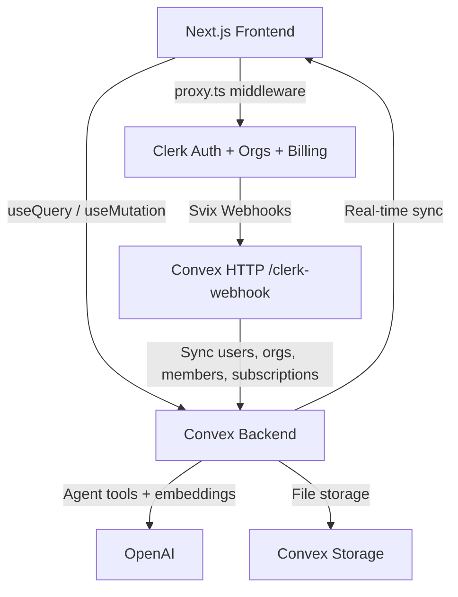

<div align="center">


# COHERE

A modern issue tracker for teams that plan, track, and ship together. Multi-tenant workspaces, real-time boards, B2B billing, and an AI agent, built with Next.js 16, Convex, and Clerk.

[](https://nextjs.org/)
[](https://convex.dev)
[](https://clerk.com)
[](https://tailwindcss.com/)
[](https://www.typescriptlang.org/)

</div>

## FEATURES

### ISSUES AND BOARDS

- Full issue tracking: statuses, five priority levels, assignees, estimates, due dates, labels
- Team-scoped issue keys (`ENG-42`, `DESIGN-7`) with per-team sequences
- Kanban board with drag and drop (@dnd-kit) and fractional sort ordering; moves sync to all clients instantly
- Full-text search over issue titles AND descriptions, with search bars on the issues list and board views showing why a result matched
- Issue templates per team (prefilled title, description, priority, labels) and recurring issues: rituals like weekly standups created automatically on a daily/weekdays/weekly/monthly cadence
- Command palette (Cmd+K) and single-key shortcuts

### COLLABORATION

- Comments with @mentions and a full activity feed per issue
- Inbox with in-app notifications for @mentions, assignments, and status changes, with a live unread badge in the sidebar
- Sub-issues and issue relations (blocks, blocked by, related, duplicate of)
- File attachments via Convex storage
- Live presence: see who is viewing the same issue

### PROJECTS AND CYCLES

- Projects group issues across teams with statuses, leads, target dates, and live progress
- Cycles are time-boxed sprints per team, auto-numbered with current-cycle tracking
- Unlimited teams per organization, each with its own board and cycles

### AI AGENT (PRO AND ENTERPRISE)

- Workspace-aware chat with org-scoped tools: create, update, and search issues, summarize cycles, report project status
- Duplicate detection via 1536-dim vector embeddings on every issue
- Triage assist: AI-suggested priority and labels for new issues
- Rate limited to 50 messages/user/day on Pro, unlimited on Enterprise

### BILLING AND MULTI-TENANCY

- Every workspace is a Clerk organization; users, memberships, and subscriptions sync to Convex via Svix-verified webhooks
- Clerk B2B billing handles checkout, plan changes, and invoices
- Two-layer plan gating: `has({ plan })` in the UI is cosmetic, Convex mutations are the real enforcement
- Free-tier limits (seats, projects, issues) enforced server-side with upgrade prompts in the UI

## PRICING TIERS

|                  | Free | Pro ($20/mo)         | Enterprise ($99/mo) |
| ---------------- | ---- | -------------------- | ------------------- |
| Members          | 3    | 10 (+$10/seat)       | Unlimited           |
| Projects         | 2    | Unlimited            | Unlimited           |
| Issues           | 100  | Unlimited            | Unlimited           |
| AI agent         | No   | 50 msgs/user/day     | Unlimited           |
| Priority support | No   | No                   | Yes                 |

## ARCHITECTURE



Key concepts:

- `orgQuery` / `orgMutation` wrappers resolve the user, org, and membership from the Clerk JWT and enforce org scoping on every Convex function (the Convex answer to RLS)
- Clerk is the source of truth: `users`, `organizations`, and `members` tables are only written by webhooks
- Route groups: `(marketing)` is the public site, `(app)/[orgSlug]` is the authenticated workspace
- `proxy.ts` replaces `middleware.ts` in Next.js 16 for route protection

## GETTING STARTED

### PREREQUISITES

- Node.js 18+ and pnpm
- Accounts on [Clerk](https://clerk.com), [Convex](https://convex.dev), and an [OpenAI](https://platform.openai.com) API key

### 1. INSTALL

```bash
pnpm install
```

### 2. ENVIRONMENT VARIABLES

Create `.env.local` in the project root (see `.env.example`):

```env
NEXT_PUBLIC_CLERK_PUBLISHABLE_KEY=pk_test_...
CLERK_SECRET_KEY=sk_test_...
NEXT_PUBLIC_CLERK_FRONTEND_API_URL=https://your-instance.clerk.accounts.dev

NEXT_PUBLIC_CLERK_SIGN_IN_URL=/sign-in
NEXT_PUBLIC_CLERK_SIGN_UP_URL=/sign-up
NEXT_PUBLIC_CLERK_SIGN_IN_FALLBACK_REDIRECT_URL=/onboarding
NEXT_PUBLIC_CLERK_SIGN_UP_FALLBACK_REDIRECT_URL=/onboarding

CONVEX_DEPLOYMENT=dev:your-deployment
NEXT_PUBLIC_CONVEX_URL=https://your-deployment.convex.cloud
NEXT_PUBLIC_CONVEX_SITE_URL=https://your-deployment.convex.site
```

Never commit `.env.local`.

### 3. CONFIGURE CLERK

1. Create a Clerk application and copy the keys into `.env.local`
2. Enable Organizations
3. Create a JWT template named exactly `convex` with these claims:

```json
{
  "org_id": "{{org.id}}",
  "org_slug": "{{org.slug}}",
  "org_role": "{{org.role}}"
}
```

4. Set up Billing with three organization plans: `free_org`, `pro`, `enterprise`
5. Attach features to the paid plans: `ai_agent`, `unlimited_projects`, `unlimited_issues`, `unlimited_seats`, `unlimited_ai`, `priority_support`
6. Copy your plan IDs into [`lib/plans.ts`](../lib/plans.ts)

### 4. CONFIGURE CONVEX

Run `npx convex dev` to create or link a project, then set env vars on the deployment:

```bash
npx convex env set CLERK_FRONTEND_API_URL https://your-instance.clerk.accounts.dev
npx convex env set CLERK_WEBHOOK_SECRET whsec_...
npx convex env set OPENAI_API_KEY sk-...
```

### 5. CONFIGURE CLERK WEBHOOKS

1. In Clerk, create a webhook endpoint pointing to `https://your-deployment.convex.site/clerk-webhook` (note `.convex.site`, not `.convex.cloud`)
2. Subscribe to `user.*`, `organization.*`, `organizationMembership.*`, and all `subscription.*` / `subscriptionItem.*` events
3. Copy the signing secret into the Convex env var `CLERK_WEBHOOK_SECRET`

### 6. RUN

```bash
pnpm dev
```

Runs Next.js and Convex in parallel. Open [http://localhost:3000](http://localhost:3000), sign up, create an organization, and you are in.

## DATABASE SCHEMA

All tables are defined in [`convex/schema.ts`](../convex/schema.ts).

| Table                    | Purpose                          | Key fields                                                             |
| ------------------------ | -------------------------------- | ---------------------------------------------------------------------- |
| users                    | Synced from Clerk via webhooks   | `clerkId`, `name`, `email`, `imageUrl`                                 |
| organizations            | Synced from Clerk Organizations  | `clerkOrgId`, `slug`, `plan`, `subscriptionStatus`                     |
| members                  | Org membership with roles        | `orgId`, `userId`, `role`                                              |
| teams                    | Teams within an org              | `orgId`, `name`, `key`, `nextIssueNumber`                              |
| issues                   | The core entity                  | `teamId`, `number`, `status`, `priority`, `sortOrder`, `embedding`     |
| labels / issueLabels     | Labels, many-to-many             | `name`, `color` / `issueId`, `labelId`                                 |
| issueRelations           | Links between issues             | `issueId`, `relatedIssueId`, `type`                                    |
| comments                 | Issue discussions                | `issueId`, `authorId`, `body`, `mentions[]`                            |
| notifications            | In-app inbox feed                | `userId`, `actorId`, `issueId`, `type`, `read`                         |
| activity                 | Audit trail per issue            | `issueId`, `actorId`, `type`, `oldValue`, `newValue`                   |
| projects                 | Cross-team initiatives           | `orgId`, `status`, `leadId`, `targetDate`                              |
| cycles                   | Sprints per team                 | `teamId`, `number`, `startDate`, `endDate`                             |
| attachments              | Files on issues                  | `issueId`, `storageId`, `fileName`                                     |
| issueTemplates           | Templates + recurring schedules  | `teamId`, `titlePrefix`, `priority`, `cadence`, `nextRunAt`            |
| views                    | Saved filter configurations      | `creatorId`, `filters`, `shared`                                       |

## PROJECT STRUCTURE

| Path                            | Purpose                                                     |
| ------------------------------- | ----------------------------------------------------------- |
| `app/(marketing)/`              | Landing and pricing pages (public)                          |
| `app/(app)/[orgSlug]/`          | The workspace: boards, issues, projects, cycles, AI, settings |
| `app/onboarding/`               | Create-or-join-organization flow                            |
| `convex/schema.ts`              | Tables, indexes, search and vector indexes                  |
| `convex/http.ts`, `convex/webhooks.ts` | Clerk webhook endpoint and sync logic                |
| `convex/lib/customFunctions.ts` | `orgQuery` / `orgMutation` wrappers                         |
| `convex/lib/limits.ts`          | Free-plan limit enforcement                                 |
| `convex/agent/`                 | AI agent: chat, tools, embeddings, triage, rate limiting    |
| `components/`                   | UI: shell, board, issues, issue detail, billing, AI         |
| `lib/plans.ts`                  | Single source of truth for Clerk plan IDs and pricing       |
| `proxy.ts`                      | Clerk middleware for route protection                       |

## COMMANDS

| Command                  | What it does                              |
| ------------------------ | ----------------------------------------- |
| `pnpm dev`               | Start Next.js and Convex in parallel      |
| `pnpm build`             | Production build                          |
| `pnpm lint`              | Run ESLint                                |
| `pnpm exec tsc --noEmit` | Type-check the project                    |
| `npx convex dev`         | Convex dev server (generates types)       |
| `npx convex deploy`      | Deploy Convex to production               |

## DEPLOYMENT

1. Deploy the frontend to [Vercel](https://vercel.com) and add all `.env.local` variables
2. Run `npx convex deploy` and set `CLERK_FRONTEND_API_URL`, `CLERK_WEBHOOK_SECRET`, and `OPENAI_API_KEY` on the production Convex deployment
3. Point the Clerk webhook at the production Convex HTTP URL and switch to production Clerk keys
4. Test end to end: sign up, create org, create issue, upgrade plan, AI chat

## TROUBLESHOOTING

| Problem                                  | Fix                                                                                  |
| ---------------------------------------- | ------------------------------------------------------------------------------------ |
| "Not authenticated" errors from Convex   | JWT template must be named exactly `convex`; set `CLERK_FRONTEND_API_URL` on Convex  |
| Org pages 404 or redirect to onboarding  | JWT template needs `org_id` / `org_slug` / `org_role` claims and an active org       |
| Webhook returns 400                      | Signing secret must match `CLERK_WEBHOOK_SECRET` (not `CLERK_SECRET_KEY`)            |
| User missing in Convex after sign-up     | Webhook URL must end with `/clerk-webhook` on the `.convex.site` domain              |
| Plan not updating after checkout         | Subscribe to all `subscription.*` and `subscriptionItem.*` webhook events            |
| AI chat errors immediately               | Set `OPENAI_API_KEY` on the Convex deployment                                        |
| Convex types not updating                | Keep `npx convex dev` running                                                        |
